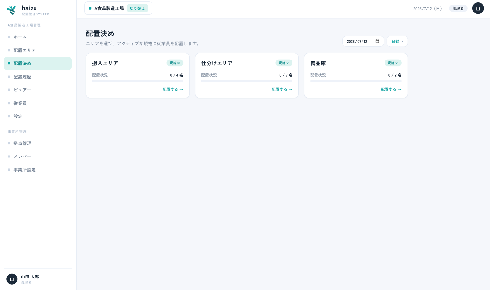
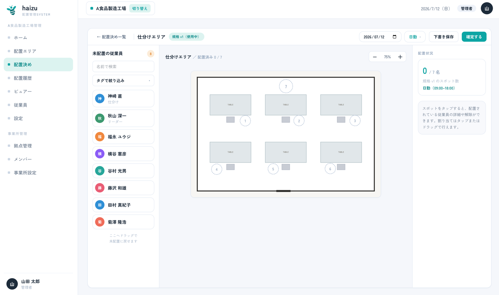
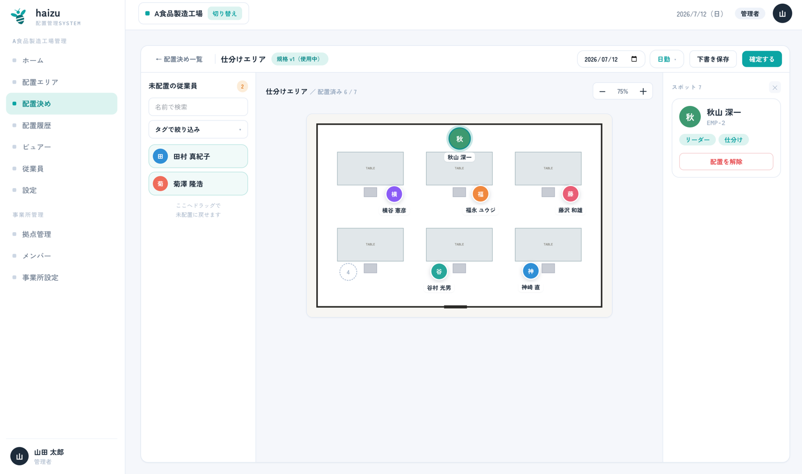
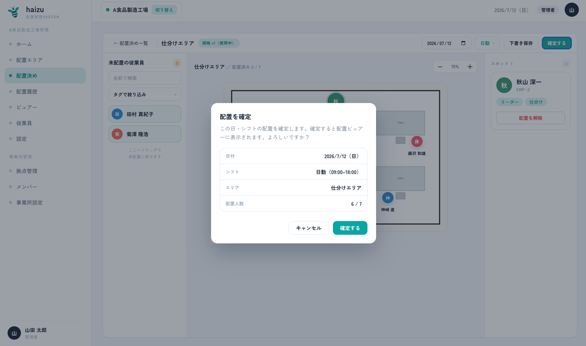

# 配置決め

日々の運用の中心です。「この日・このシフトで、誰をどこに立たせるか」を決めます。

[English](assignment.md) · [マニュアル目次に戻る](index.ja.md)

## できること

- **日付** と **シフト**、そしてエリアを選ぶ
- 未配置リストから従業員をスポットへドラッグ（またはタップ）で配置する
- 未配置リストを **名前** や **タグ** で絞り込む
- **下書き保存** する、または **確定する** で現場に公開する
- 確定済みの配置を **更新する** / **下書きに戻す**

この画面の背後にあるルール： [docs/domain/assignment.md](../domain/assignment.md)

## 配置決めの前提

前提は2つあり、足りない場合は画面が教えてくれます。

| 表示されるメッセージ | 対処 |
|---|---|
| *勤務体制（シフト）が未登録です* | [設定](settings.ja.md#働き方シフト設定)でシフトを登録する |
| *この日付に適用される規格がありません* | [配置エディタ](editor.ja.md)で、適用開始日をその日以前にして規格を公開する |

つまずきやすいのは2つ目です。規格が**下書き**のままのエリアは配置決めできません。公開して初めてここに現れます。

## 操作手順

1. 配置決め一覧で日付とシフトを選びます。エリアごとに配置状況と規格バージョンが表示されます。**配置する →** を押します。

2. 左の **未配置の従業員** に、まだ配置されていない有効な従業員が並びます。**名前で検索** や **タグで絞り込み** で絞れます。

3. 配置します。
   - 従業員をスポットへ **ドラッグ** する、または
   - 従業員を **タップ** してからスポットをタップする

4. 解除するには、スポットをタップして **配置を解除** を選ぶか、未配置リストへドラッグして戻します。
5. 途中でやめるときは **下書き保存**。確定してよければ **確定する** を押します。確認ダイアログに日付・シフト・エリア・配置人数が表示されます。

ヘッダーには進捗（*配置済み 12 / 20*）と使用中の規格バージョンが表示されます。

## 下書きと確定の違い

| 状態 | ビュアーに表示 | ホームでの表示 |
|---|---|---|
| 下書き | されない | *下書きあり* |
| 確定済み | **される** | 配置済み |

現場に配置を見せるのは「確定」の操作です。確定するまでは自分にしか見えていません。

確定すると **確定済み** バッジが付きます。その後も **更新する**（編集して再確定）や、**下書きに戻す**（ビュアーから取り下げる）ができます。

## 注意点

- 未配置リストに出るのは **有効** な従業員だけです。[従業員](employees.ja.md)画面で無効にすると候補に出なくなります。
- 1スポットに配置できるのは1人だけです。
- 後から[シフト設定](settings.ja.md#働き方シフト設定)を変更すると、変更・削除したシフトで作成中の**下書き**は、設定を保存した時点で破棄されます。確定済みの配置は破棄されません。代わりに、影響を受けた日の配置決め画面に注意書きが表示され、当時確定した内容を保持している[配置履歴](history.ja.md)へ誘導されます。
- 配置決めを作成・編集できるのは **管理者** と **拠点管理者** だけです。
