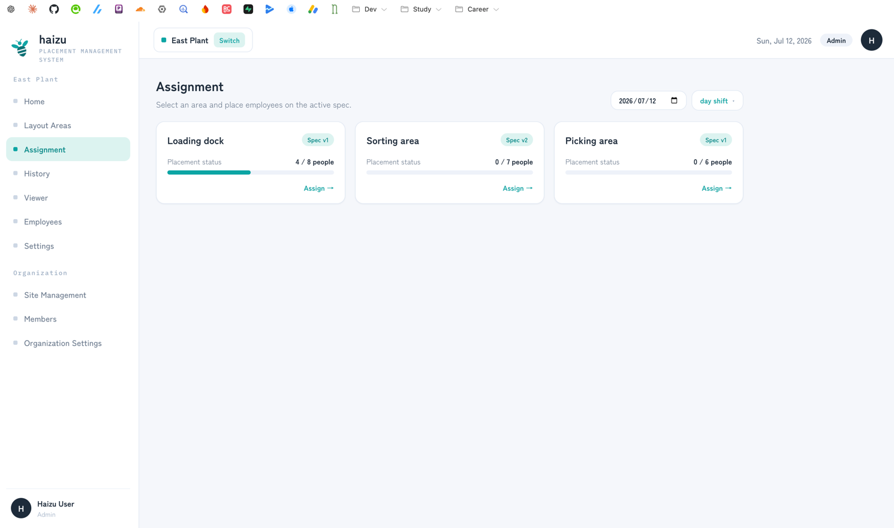
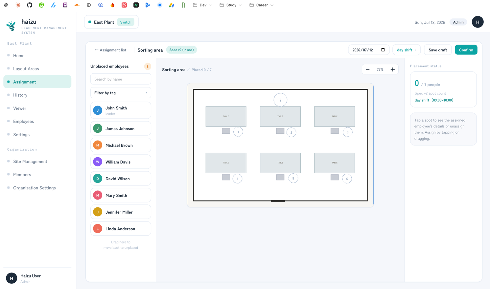
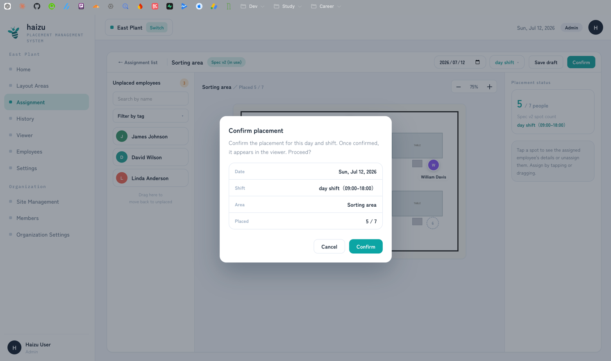
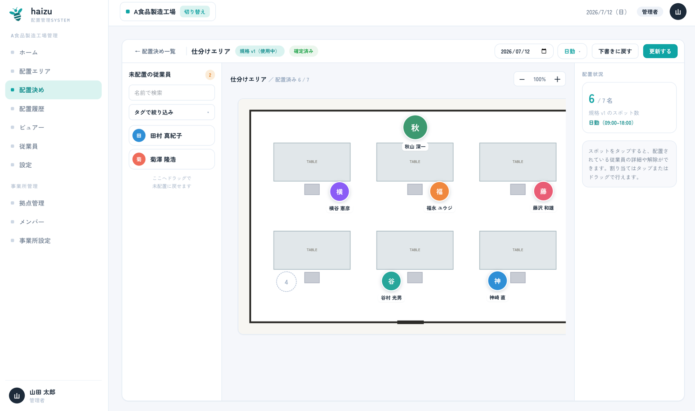

# Assignment

The daily loop: for this date and this shift, who stands where.

[日本語](assignment.ja.md) · [Back to guide index](index.md)

## What you can do

- Pick a **date** and a **shift**, then an area
- Drag (or tap) employees from the unplaced list onto spots
- Filter the unplaced list by **name** or by **tag**
- Save as a **draft**, or **Confirm** to publish it to the floor
- **Revert to draft** / **Update** a placement you already confirmed

The rules behind this screen: [docs/domain/assignment.md](../domain/assignment.md).

## Before you can assign

Two prerequisites, and the screen tells you which one is missing:

| Message | What to do |
|---|---|
| *Work system (shifts) not registered* | Register shifts in [settings](settings.md#shifts) |
| *No spec applies to this date* | Publish a spec in the [layout editor](editor.md) with an effective date on or before this date |

The second one catches people out: an area with a *draft* spec is not assignable. Publishing is what makes it appear here.

## Steps

1. On the assignment list, choose the date and shift. Each area shows its placement status and spec version. Press **Assign →**.

2. On the left, **Unplaced employees** lists everyone active who isn't placed yet. Narrow it with **Search by name** or **Filter by tag**.

3. Place people:
   - **Drag** an employee onto a spot, or
   - **Tap** the employee, then tap the spot.

4. To undo one: tap the spot and choose **Unassign**, or drag the person back onto the unplaced list.
5. **Save draft** to stop halfway. **Confirm** when the placement is final.

The header shows progress (*Placed 12 / 20*) and which spec version is in use.

## Draft vs confirmed

| State | Visible in the viewer | Shown on Home as |
|---|---|---|
| Draft | No | *Has draft* |
| Confirmed | **Yes** | placed |

Confirming is the step that shows the placement to the floor. Until then it's yours alone.

After confirming, the placement is marked **Confirmed**. You can still **Update** it (edit and re-confirm), or **Revert to draft** to pull it back off the viewer.

## Notes

- Only **active** employees appear in the unplaced list. Deactivate someone in [Employees](employees.md) and they stop being offered.
- Each spot holds exactly one person.
- If you change [shift settings](settings.md#shifts) later, drafts in progress for the changed or deleted shifts are discarded when you save the settings. Confirmed placements are not touched — instead, the assignment screen for an affected day shows a notice pointing you at the [history](history.md), which preserves what was actually confirmed at the time.
- Only **Admin** and **Site Admin** can create or edit assignments.
