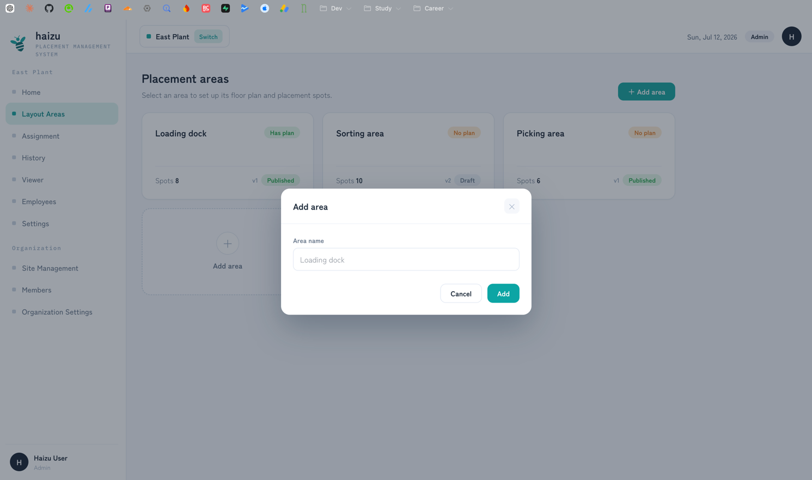
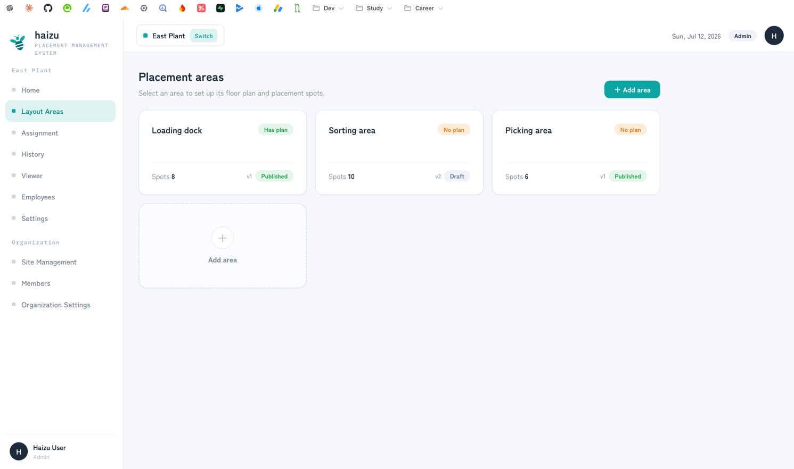
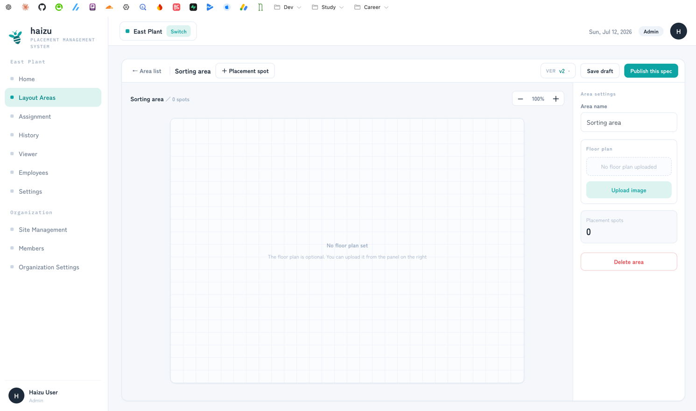
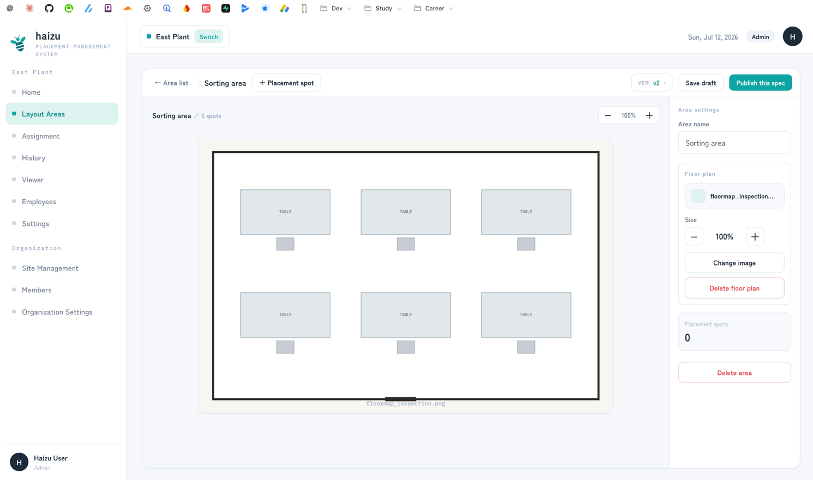
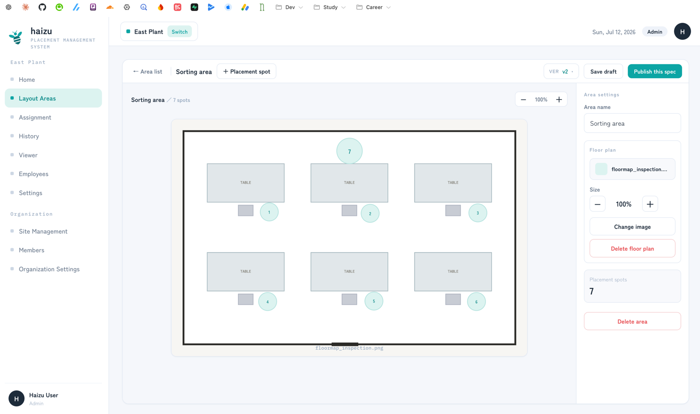
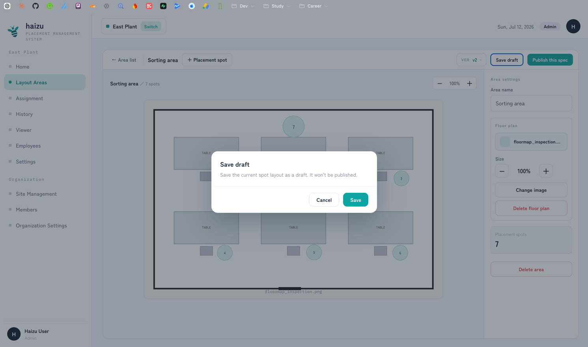
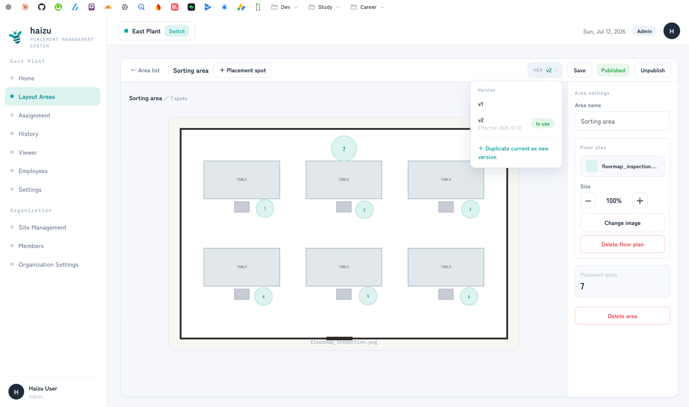

# Layout areas (the placement editor)

Where you draw the floor: a plan image, and the spots people stand on. You do this once per area, then only rarely again.

[日本語](editor.ja.md) · [Back to guide index](index.md)

## What you can do

- Create **placement areas** (one work area within the site: "Inspection room", "Line A", …)
- Upload a **floor plan** image and size it
- Place **placement spots** — one spot is one position for one person
- Save a **draft**, then **publish** it as a version with an **effective date**
- Create a **new version** later, when the layout changes, without disturbing past assignments

The vocabulary is defined in [docs/domain/layout_spec.md](../domain/layout_spec.md).

## Steps

### Create an area

1. **＋ Add area**, enter an **Area name** (e.g. "Loading dock"), then **Add**.

2. The area list shows each area's plan status (**Has plan** / **No plan**), spec status (**Published** / **Draft**), and spot count.

### Upload a floor plan

In the area, open the right-hand panel:

1. **Upload image** under **Floor plan**, and pick the image.
2. Adjust **Size** if needed. **Change image** replaces it, **Delete floor plan** removes it.

The floor plan is optional — you can place spots without one — but it's what makes the placement legible on the monitor.

### Place spots

1. **＋ Placement spot** adds a spot.
2. Drag it into position. Drag the handle at its bottom-right to resize, or set **Size** in the panel.
3. Give it a **Label** (the panel's **Placement spot settings**). The label is how the floor identifies the position.
4. **Delete spot** removes it.

Up to **100 spots** per area.

### Publish

1. **Save draft** keeps your work without publishing. Nothing you haven't saved is kept.
2. **Publish this spec** opens a dialog. Set the **Effective date** (required), then **Publish**.

**Assignment and the viewer only use published versions.** For a given date they use the newest published version whose effective date is on or before that date. So a draft, however complete, is invisible to them.

**Unpublish** reverts a published version to draft — but only if no assignment uses it yet.

## Versions: changing a layout that's already in use

Once a version has been used in an assignment, it is frozen: it can't be edited, deleted, or unpublished. This is deliberate — it's what keeps past assignments (and [history](history.md)) truthful.

To change such a layout:

1. **＋ Duplicate current as new version** — this copies the current spec into a new version.
2. Edit the spots.
3. Publish it with an **effective date** from which the new layout applies.

Dates before that effective date keep resolving to the old version. Dates on or after it get the new one.

Two things surprise people here:

- Duplicating does **not** create the version immediately. The new version is only recorded once you **save or publish** after editing. Leave without saving and nothing remains.
- Publishing a version that is **not the latest** has no effect on assignment or the viewer — the editor warns you about this. Resolution picks the *newest* published version on or before the date, so an older one never wins. If you want to change what's in use, create a new version.

## Deleting an area

**Delete area** removes the floor plan, every version, and every spot, irreversibly.

If **any** version of the area has ever been used in an assignment, the area can't be deleted (the button says so). Individual unused versions can't be deleted either — but an unpublished draft is harmless, so you can simply leave it.

## Notes

- **Changes aren't reflected unless you save.** The canvas is a working copy.
- On concurrent edits by two people, last write wins.
- Only **Admin** and **Site Admin** can edit. General users can only view; "other" can't open the screen at all.
