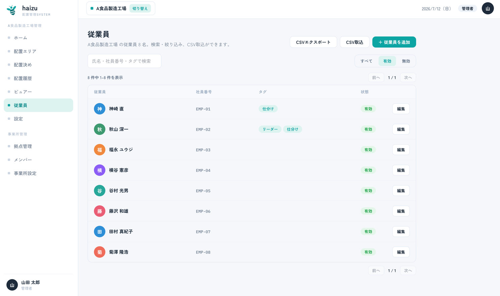
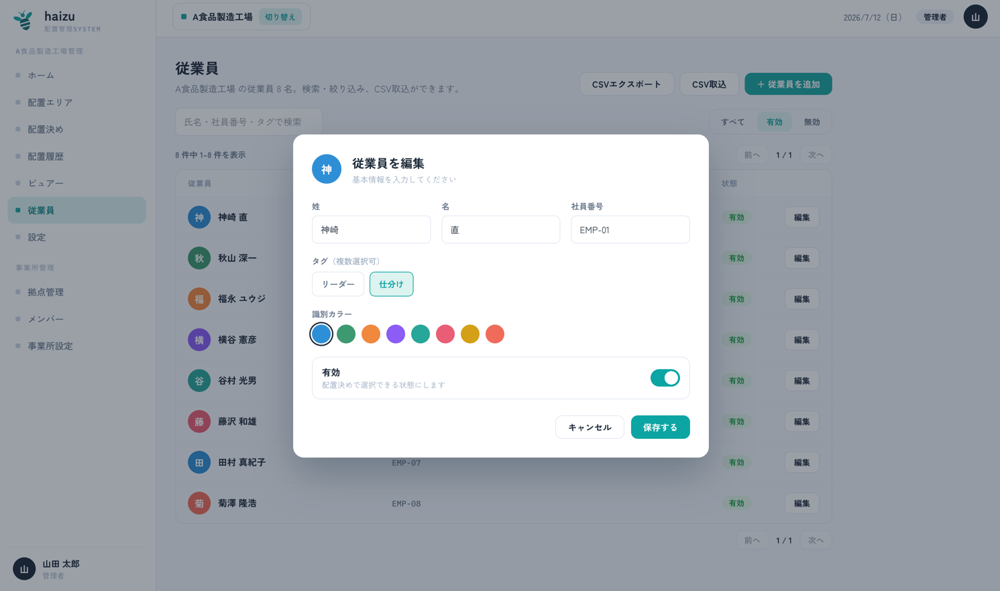
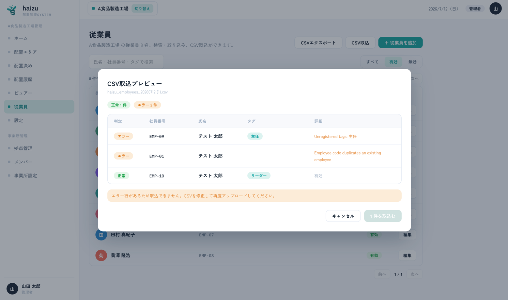

# 従業員

マップ上に配置される人たちです。従業員は **ログインしません**。ログインする管理者については [メンバー](members.ja.md) を参照してください。

[English](employees.md) · [マニュアル目次に戻る](index.ja.md)

## できること

- 従業員の追加・編集・無効化
- 氏名・社員番号・タグでの検索、有効／無効での絞り込み
- **識別カラー** の設定（マップ上のアバターの色）
- **タグ** の付与（1人あたり最大10個）
- **CSV取込** と **CSVエクスポート**

属性の定義は [docs/domain/employee.md](../domain/employee.md) にあります。

## 1人ずつ追加する

**＋ 従業員を追加** から入力します。

| 項目 | 補足 |
|---|---|
| 社員番号 | 必須。拠点内で一意 |
| 姓 / 名 | 必須 |
| 識別カラー | パレットから選択。フロアマップ上のアバターに使われます |
| タグ | 複数選択可。タグは事前に登録が必要です（[設定 → タグ管理](settings.ja.md#タグ管理)） |
| 有効 | *配置決めで選択できる状態にします*。チェックを外すと記録は残したまま、候補に出なくなります |

退職者は削除ではなく「無効」にするのが基本です。配置決めの候補から消えますが、過去の[配置履歴](history.ja.md)はそのまま残ります。

## CSV取込

名簿をまとめて登録する方法です。

1. 列の並びを確認したい場合は、先に **CSVエクスポート** してください。エクスポートと取込の列は同じです。
2. **CSV取込** でファイルを選ぶと、**CSV取込プレビュー** が開き、各行が **正常** か **エラー** かで表示されます。
3. エラーがあれば修正して再アップロードします。**エラー行が1行でもあると取込できません**（全件取り込むか、取り込まないかのどちらかです）。
4. **N 件を取込む** で確定します。

### 列の仕様

以下の固定順です（ヘッダー行は読み飛ばされます。ヘッダーの文字列ではなく**列の位置**で判定されます）。

| # | 列 | 補足 |
|---|---|---|
| 1 | 従業員コード | 必須・一意 |
| 2 | 姓 | 必須 |
| 3 | 名 | 必須 |
| 4 | アバターカラー | 不正な値や空の場合は既定色になります |
| 5 | ステータス | `Inactive` で無効。それ以外（空欄を含む）は有効 |
| 6〜15 | タグ1 … タグ10 | タグ**名**。事前に登録済みである必要があります |

1ファイルあたり **最大1000行** です。超える場合は分割してください。

### 表示されるエラー

- *従業員コードが空 / 姓が空 / 名が空*
- *CSV内で従業員コードが重複しています*
- *既存の従業員と従業員コードが重複しています*
- *未登録のタグ: …* — [設定 → タグ管理](settings.ja.md#タグ管理)で先にタグを作成してください
- *タグは最大10個までです* — 11列目以降のタグ列に値がある場合も該当します

## 注意点

- 従業員は **選択中の拠点** に属します。
- 従業員を作成・編集・削除できるのは **管理者** と **拠点管理者** だけです。
