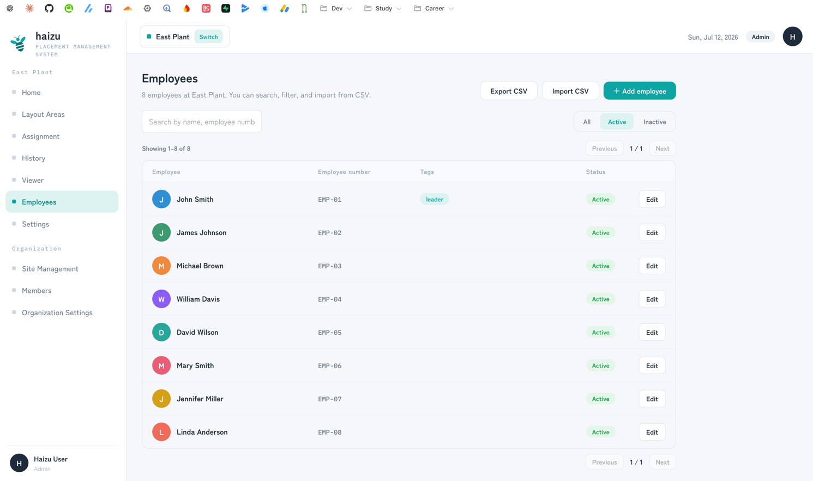
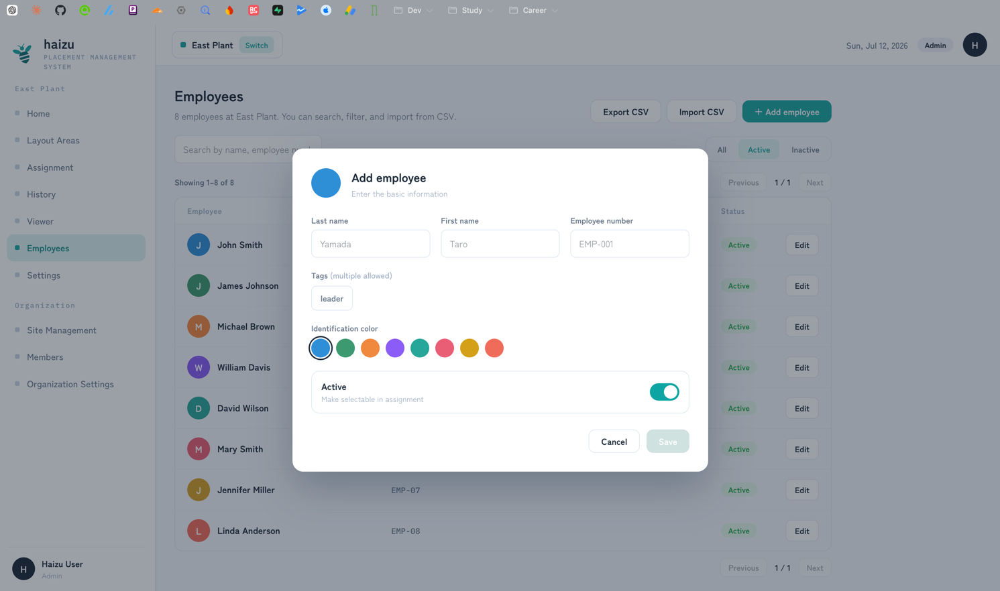
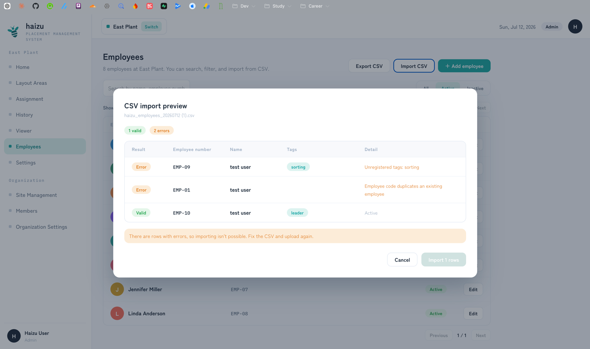

# Employees

The people you place on the map. Employees **do not log in** — for the administrators who do, see [Members](members.md).

[日本語](employees.ja.md) · [Back to guide index](index.md)

## What you can do

- Add, edit, and deactivate employees
- Search by name, employee number, or tag; filter by Active / Inactive
- Give each one an **identification color** (the avatar color shown on the map)
- Apply **tags** (up to 10 per employee)
- **Import CSV** and **Export CSV**

Attributes are defined in [docs/domain/employee.md](../domain/employee.md).

## Adding one employee

**＋ Add employee**, then fill in:

| Field | Notes |
|---|---|
| Employee number | Required, and unique within the site |
| Last name / First name | Required |
| Identification color | Picked from the palette; used for the avatar on the floor map |
| Tags | Multiple allowed. Tags must already exist — create them in [Settings → Tag management](settings.md#tags) |
| Active | *Make selectable in assignment.* Uncheck to keep the record but stop offering them |

Deactivating is the way to handle someone who has left: they disappear from the assignment pool but past [history](history.md) stays intact.

## CSV import

For a whole roster at once.

1. **Export CSV** first if you want the exact column layout — the export and the import use the same columns.
2. **Import CSV**, choose the file. A **CSV import preview** opens showing every row as **Valid** or **Error**.
3. Fix any errors and re-upload. **You cannot import while any row has an error** — it's all-or-nothing.
4. **Import N rows** commits.

### Columns

In this fixed order (the header row is skipped; only position matters, not the header text):

| # | Column | Notes |
|---|---|---|
| 1 | Employee Code | Required, unique |
| 2 | Last Name | Required |
| 3 | First Name | Required |
| 4 | Avatar Color | An invalid or empty value falls back to the default color |
| 5 | Status | `Inactive` marks them inactive; anything else (including empty) means active |
| 6–15 | Tag1 … Tag10 | Tag **names**. Each must already exist |

Up to **1000 rows** per file. Split larger rosters.

### Errors you'll see

- *Employee code is empty* / *Last name is empty* / *First name is empty*
- *Duplicate employee code within the CSV*
- *Employee code duplicates an existing employee*
- *Unregistered tags: …* — create the tag first in [Settings → Tag management](settings.md#tags)
- *Up to 10 tags allowed* — also triggered by values in an 11th tag column

## Notes

- Employees belong to the **selected site**.
- Only **Admin** and **Site Admin** can create, edit, or delete employees.
