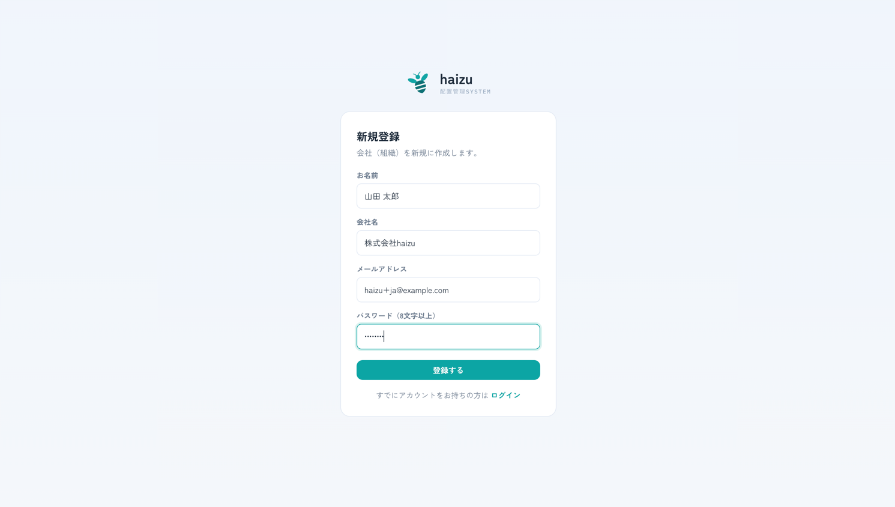
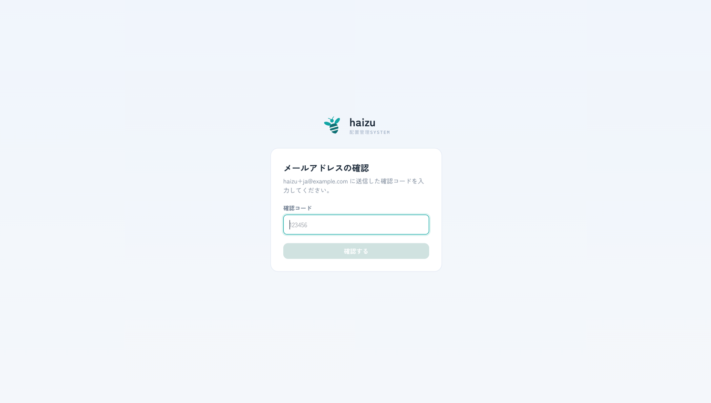
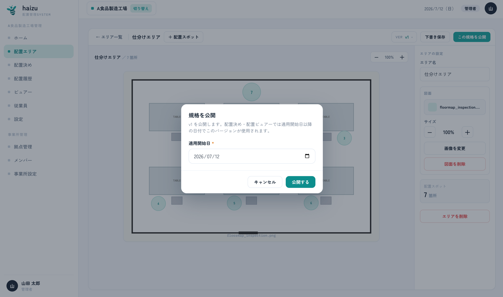

# はじめかた

サインアップから、現場のモニターに配置が映るまで。所要時間は30分ほどです。

[English](getting-started.md) · [マニュアル目次に戻る](index.ja.md)

これがアプリの想定する順序です。ホーム画面にも同じ順序が「初期セットアップ」の3ステップとして表示されるので、そちらをたどっても構いません。

## 0. 新規登録

社内にまだ誰もアカウントを持っていない場合、代表者1人が組織を作成します。

1. アプリを開き **新規登録** を選びます。
2. お名前・会社名・メールアドレス・パスワード（8文字以上）を入力します。これで **事業所（組織）** が作成され、あなたがその **管理者** になります。
3. メールに届いた確認コードを入力します。

> 確認コードは、その環境で設定されたメールアダプタ経由で届きます。ローカルの初期設定では実際には送信されず、APIサーバーのコンソールに出力されます。→ [README](../../README.ja.md)

他のメンバーは新規登録ではなく、後述の [メンバー](members.ja.md) 画面から招待してください。新規登録すると**別の組織**が作られてしまいます。

## 1. 拠点を選択

**拠点** は工場・倉庫1つを指します。新規登録時に最初の1つが作られます。

[拠点選択](site-selection.ja.md)画面で選んでください。ここで選んだ拠点が以降ほぼすべての基準になります（従業員・エリア・配置はすべて拠点に属します）。拠点はサイドバーの **切り替え** から後で変更できます。

拠点を追加するには [設定 → 拠点管理](settings.ja.md#拠点管理)（管理者のみ）を参照してください。

## 2. シフトを登録

設定 → **働き方（シフト）設定**

1日をどう区切るかを決めます。どちらかを選びます。

- **シフトなし** — 1日1シフト。時間帯の区分なし。
- **シフトあり** — 日勤・遅番・夜勤など、名前と時間で区分する。

「シフトあり」を選んだ場合は、シフト名・開始・終了を入力して各シフトを追加します。

以降のすべてがこの設定に依存するため、チェックリストの1番目になっています。詳細は [settings.ja.md](settings.ja.md#働き方シフト設定) を参照してください。

## 3. 従業員を登録

サイドバーの **従業員**

配置される人たちです。ログインはしません。**＋ 従業員を追加** で1人ずつ登録するか、**CSV取込** で一括登録します。

人数が多い場合はCSVが早道ですが、タグを付けたCSVを取り込むには、そのタグが先に登録されている必要があります。詳細は [employees.ja.md](employees.ja.md) を参照してください。

## 4. 配置エリアを作り、規格を公開する

サイドバーの **配置エリア**。ここは「保存」と「公開」が別物のため、中途半端で止まりやすいステップです。

1. **＋ エリアを追加** で名前を付けます（例：「荷捌き場」）。**配置エリア** は拠点内の作業エリア1つを指します。
2. 必要なら右のパネルから図面画像をアップロードします。図面は任意ですが、あると配置が格段に読みやすくなります。
3. 人が1人立つ位置ごとに **＋ 配置スポット** を追加します。ドラッグで移動、右下のハンドルをドラッグでサイズ変更、それぞれにラベルを付けられます。
4. 途中で **下書き保存** します。
5. レイアウトが固まったら **この規格を公開** します。**適用開始日** の入力が必須です。

**公開して初めてそのエリアが使えるようになります。** 配置決めとビュアーが使うのは公開済みバージョンだけです。ある日付に対しては「適用開始日がその日以前で、最も新しい公開済みバージョン」が使われます。下書きはこれらの画面からは見えません。

後からレイアウトを変更する場合のバージョンの扱いを含め、詳細は [editor.ja.md](editor.ja.md) を参照してください。

## 5. 人を配置する

サイドバーの **配置決め**

1. 日付とシフトを選び、エリアを選びます（**配置する →**）。
2. 左の **未配置の従業員** からスポットへドラッグします。タップでも配置できます。
3. **確定する** を押します。

確定するまでは下書き扱いで、ビュアーには表示されません。詳細は [assignment.ja.md](assignment.ja.md) を参照してください。

## 6. 現場に映す

サイドバーの **ビュアー** から、対象エリアの **大きく表示 →**

現場のモニターにこの画面を映してください。初期状態では現在時刻に追従して今日のシフトを自動表示します。特定の日付・シフトを強制表示することもできます。詳細は [viewer.ja.md](viewer.ja.md) を参照してください。

## 続いて：同僚を招待する

**メンバー** → **＋ メンバーを招待**。メンバーはログインする管理者です。拠点ごとに、何ができるかを設定します。

現場を複数人で回している場合は、担当拠点の **拠点管理者** として招待するとよいでしょう。詳細は [members.ja.md](members.ja.md) を参照してください。

## 次に読むもの

- 日々の運用サイクルを詰める → [assignment.ja.md](assignment.ja.md)
- タグで従業員を絞り込みやすくする → [settings.ja.md](settings.ja.md#タグ管理)
- モニターに何をいつ映すかを調整する → [settings.ja.md](settings.ja.md#配置ビュアー設定)
