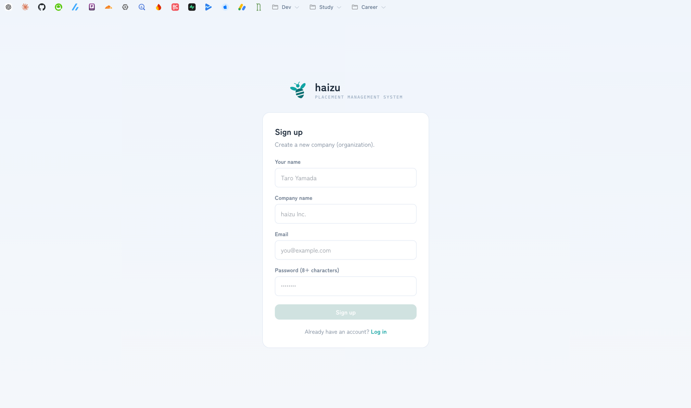
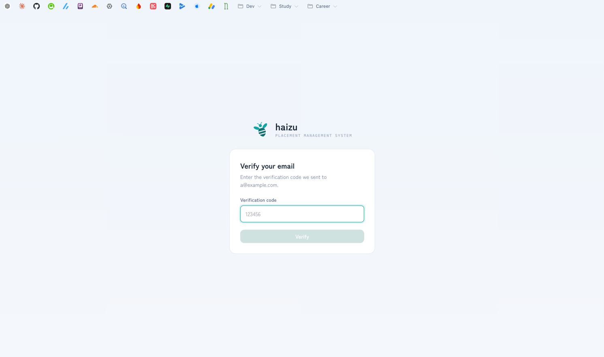
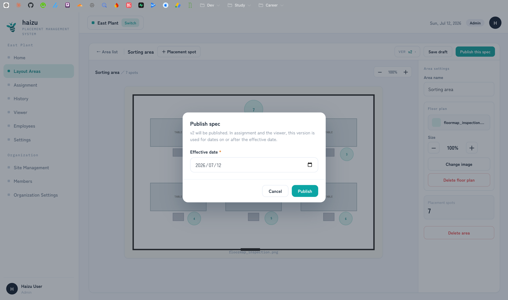
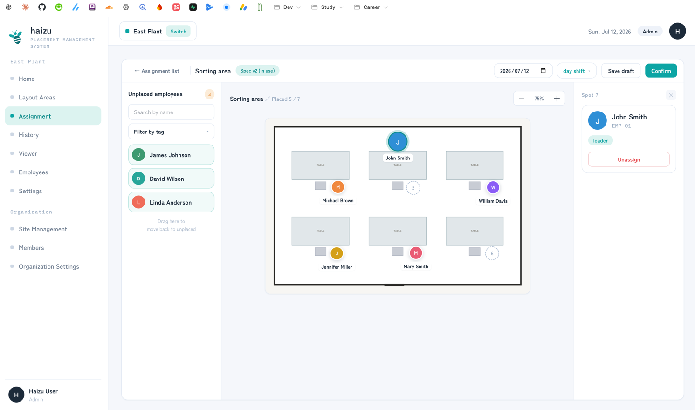
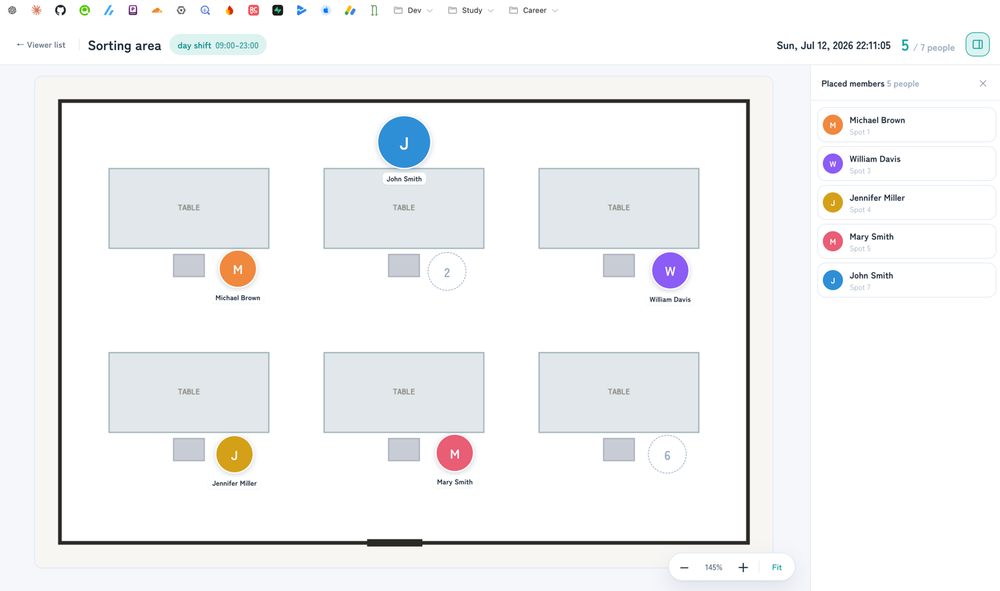

# Getting started

From sign-up to a placement showing on the floor's monitor. Allow about 30 minutes.

[日本語](getting-started.ja.md) · [Back to guide index](index.md)

This is the order the app expects. Home shows the same order as a 3-step **Initial setup** checklist, so you can also just follow that.

## 0. Sign up

If nobody in your company has an account yet, one person creates the organization.

1. Open the app and choose **Sign up**.
2. Enter your name, your company name, your email, and a password (8+ characters). This creates the **organization** and makes you its **Admin**.
3. Enter the verification code sent to your email.

> Verification codes are delivered by whatever email adapter the deployment uses. On a default local install nothing is actually sent — the code is printed to the API server console. See the [README](../../README.md).

Everyone else should be invited later from [Members](members.md) rather than signing up, since signing up creates a *separate* organization.

## 1. Select a site

A **site** is one factory or warehouse. Sign-up creates your first one.

Pick it on the [site selection](site-selection.md) screen. The site you pick scopes almost everything that follows — employees, areas, and assignments all belong to a site. You can switch sites later from the sidebar (**Switch**).

To add more sites, see [Settings → Site management](settings.md#site-management) (Admins only).

## 2. Register shifts

Settings → **Work style (shift) settings**.

Decide how the day is divided. Choose one:

- **No shifts** — one shift per day, no time divisions.
- **With shifts** — divide by name and time (day / late / night, etc.).

If you choose "with shifts", add each shift with a name, a start time, and an end time.

Everything downstream depends on this, which is why it's step 1 of the checklist. Details: [settings.md](settings.md#shifts).

## 3. Register employees

**Employees** in the sidebar.

These are the people to be placed — they don't log in. Add them one at a time with **＋ Add employee**, or import a spreadsheet with **Import CSV**.

For a large roster, CSV is the fast path, but note that tags must already exist before you can import employees carrying them. Details: [employees.md](employees.md).

## 4. Draw the placement area and publish it

**Layout Areas** in the sidebar. This is the step people most often get half-finished, because saving is not publishing.

1. **＋ Add area** and name it (e.g. "Loading dock"). A **layout area** is one work area within the site.
2. Optionally upload a floor plan image from the right-hand panel. The plan is optional but makes the placement far easier to read.
3. Add **＋ Placement spot** for each position where one person stands. Drag to move, drag the bottom-right handle to resize, and give each spot a label.
4. **Save draft** as you go.
5. **Publish this spec** when the layout is final. You must set an **Effective date**.

**Publishing is what makes the area usable.** Assignment and the viewer only ever use published versions: for any given date, they use the newest published version whose effective date is on or before that date. A draft is invisible to them.

Details, including how versions work when you later change the layout: [editor.md](editor.md).

## 5. Assign people

**Assignment** in the sidebar.

1. Pick the date and the shift, then pick the area (**Assign →**).
2. Drag employees from **Unplaced employees** on the left onto the spots. Tapping works too.
3. **Confirm**.

Until you confirm, the placement is a draft and the viewer will not show it. Details: [assignment.md](assignment.md).

## 6. Show it on the floor

**Viewer** in the sidebar, then **Show large →** on the area.

Point the floor's monitor at this screen. By default the viewer follows the current time and shows today's shift automatically; you can instead force a specific date and shift. Details: [viewer.md](viewer.md).

## Then: invite your colleagues

**Members** → **＋ Invite member**. Members are the administrators who log in. You set what each one can do, per site.

If several people run the floor, invite them as **Site Admin** for their site. Details: [members.md](members.md).

## What next

- Refine the day-to-day loop: [assignment.md](assignment.md)
- Group employees for easier filtering with tags: [settings.md](settings.md#tags)
- Tune what the monitor shows and when it switches: [settings.md](settings.md#viewer-settings)
