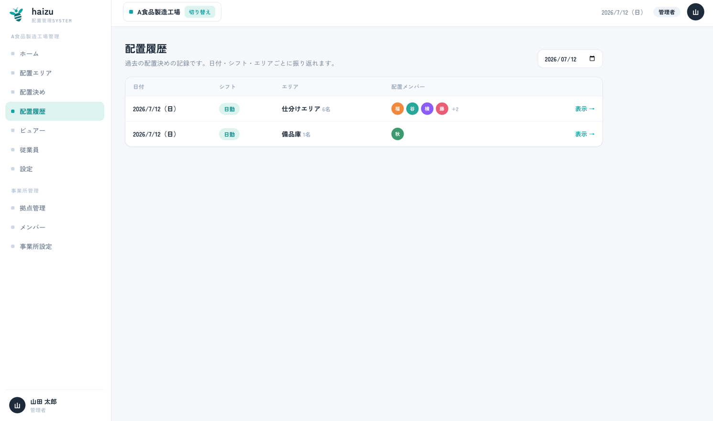
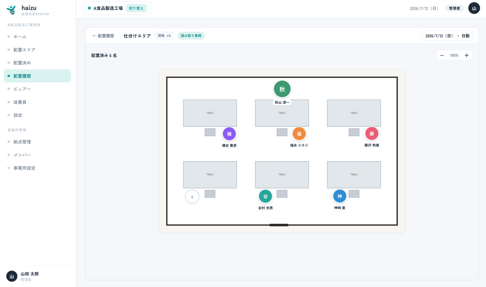

# 配置履歴

過去の確定済み配置を、確定した当時のまま記録しています。読み取り専用です。

[English](history.md) · [マニュアル目次に戻る](index.ja.md)

## できること

- 過去の配置を **日付** で検索し、シフト・エリアごとに振り返る
- 記録を開き、当時の図面と配置されていた人を確認する

## 操作手順

1. サイドバーの **配置履歴** を開きます。初期表示は前日です。
2. 日付を変更すると他の日を検索できます。表には **日付**・**シフト**・**エリア**・**配置メンバー**の人数が並びます。件数が多い場合はページ送りで移動します。
3. **表示 →** で当時の配置が開きます（**読み取り専用**）。

## 注意点

- **記録されるのは確定済みの配置だけです。** 下書きは履歴になりません。
- 履歴は「実際に確定された内容」の記録なので、後からシフトや規格を変更しても影響を受けません。シフト設定を変更した場合、影響を受けた日の配置決め画面から、当時の内容を確認するためにこの画面へ誘導されます。
- その日に使われた規格バージョンに図面がなかった場合は、図面なしで配置内容が表示されます。
- 閲覧できるのは **管理者**・**拠点管理者**・**一般** です。→ [members.ja.md](members.ja.md#権限)
