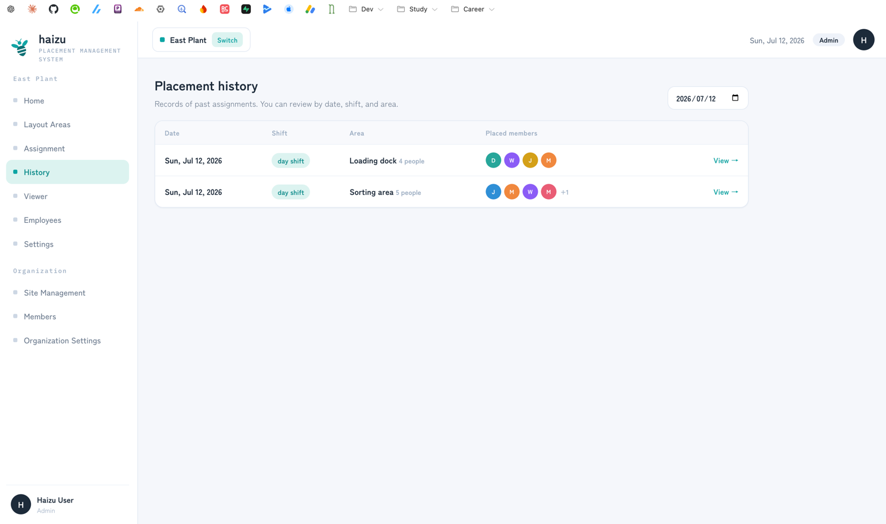
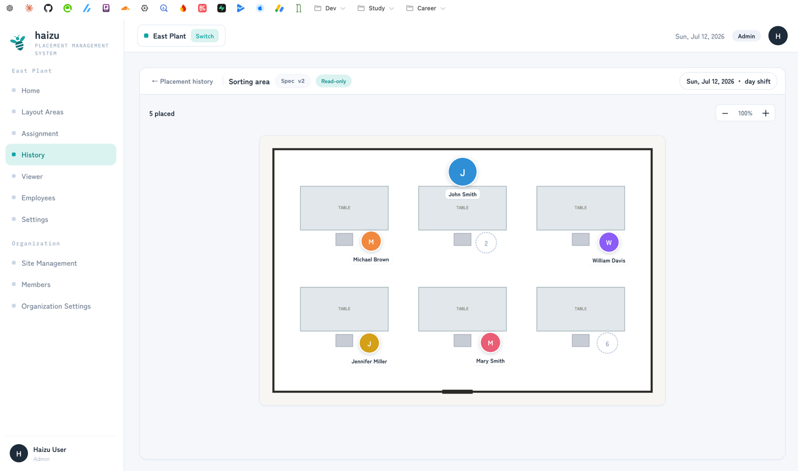

# History

Past confirmed placements, exactly as they were confirmed. Read-only.

[日本語](history.ja.md) · [Back to guide index](index.md)

## What you can do

- Look up past placements by **date**, and read them by shift and area
- Open one and see the floor plan with the people who were on it

## Steps

1. **History** in the sidebar. It opens on yesterday's date.
2. Change the date to look up another day. The table lists **Date**, **Shift**, **Area**, and the number of **Placed members**; page through with the pager.
3. **View →** opens the placement as it was, marked **Read-only**.

## Notes

- **Only confirmed placements are recorded.** Drafts never become history.
- History is the record of what was actually confirmed, so it survives later changes to shifts or to the layout spec. When you change shift settings, the assignment screen for an affected day will point you here to see what it was at the time.
- If the spec version used that day had no floor plan, the record shows the placement without one.
- Visible to **Admin**, **Site Admin**, and **General**. See [members.md](members.md#permissions).
