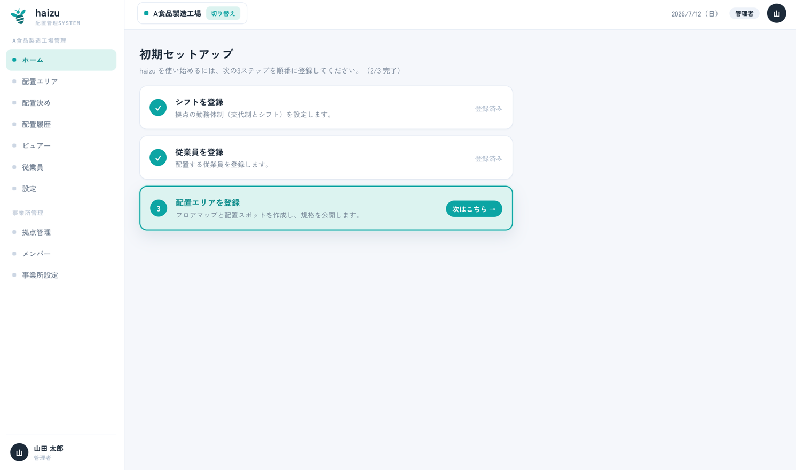
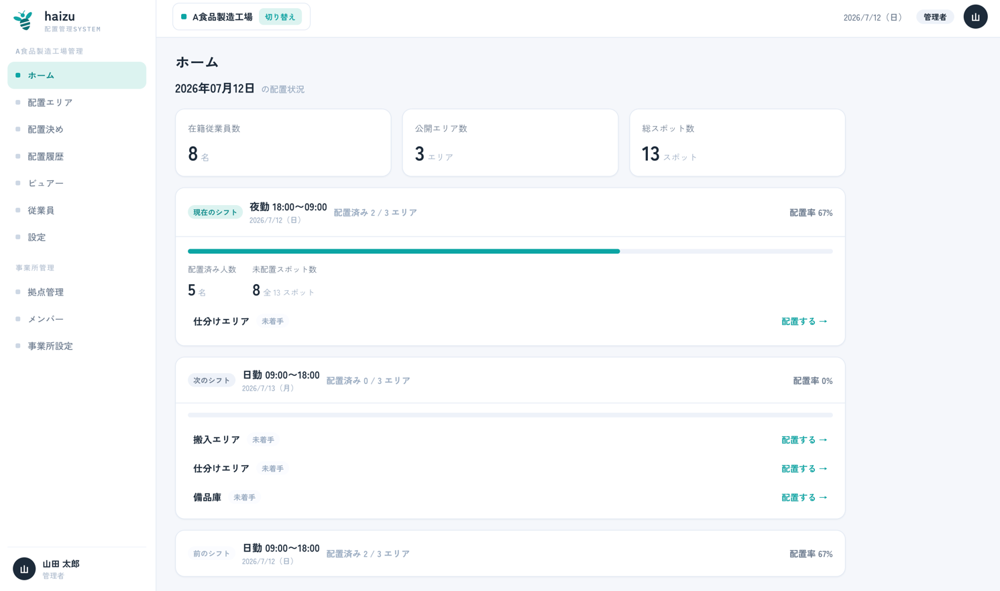

# ホーム

ログイン後に最初に開く画面です。「セットアップの残りは何か」「今日の配置は埋まっているか」の2つに答えます。

[English](home.md) · [マニュアル目次に戻る](index.ja.md)

## できること

- **初期セットアップ** のチェックリストに沿って、拠点が使える状態になるまで進める
- 今日のシフト別の配置状況を確認し、未配置のエリアへそのまま移動する

## 初期セットアップ

3ステップすべてが終わるまで、ホームには進捗つきのチェックリストが表示されます。

| ステップ | 内容 | 完了条件 |
|---|---|---|
| **シフトを登録** | 拠点の勤務体制（交代制とシフト）を設定する | シフト設定を保存した |
| **従業員を登録** | 配置する従業員を登録する | 従業員が1名以上いる |
| **配置エリアを登録** | フロアマップと配置スポットを作成し、規格を公開する | 規格を**公開**した。下書きのままだと「下書きあり（未公開）」と表示され、完了になりません |

現在のステップのボタン（**次はこちら →** / **続きから →**）を押すと該当画面に移動します。上から順に進めてください。各ステップは1つ上のステップに依存します。

3つとも完了するとチェックリストは表示されなくなります。

## 配置状況

セットアップが完了すると、ホームには現在のシフトの状況が、**前のシフト**・**次のシフト**と並んで表示されます。「現在のシフト」は[シフト設定](settings.ja.md#働き方シフト設定)の時間帯から判定されます。

シフトごとに次が分かります。

- **配置率** と **配置済み人数**
- 全スポット中の **未配置スポット数**
- エリアごとの状態（配置済み／**下書きあり**／**未着手**）と、**配置する →** ボタン。押すと該当の日付・シフト・エリアで[配置決め](assignment.ja.md)が開きます

このほか **在籍従業員数**・**公開エリア数**・**総スポット数** も表示されます。

> 下書きの配置は「配置済み」ではなく「下書きあり」として数えられます。[ビュアー](viewer.ja.md)に出るのは確定済みの配置だけです。

## 注意点

- ホームは **選択中の拠点** の情報のみを表示します。別拠点を見るにはサイドバーで拠点を切り替えてください。
- ホームを開けるのは **管理者**・**拠点管理者**・**一般** です。「その他」（ビュアー閲覧のみ）の権限では開けず、[ビュアー](viewer.ja.md)のみ利用できます。→ [members.ja.md](members.ja.md#権限)
