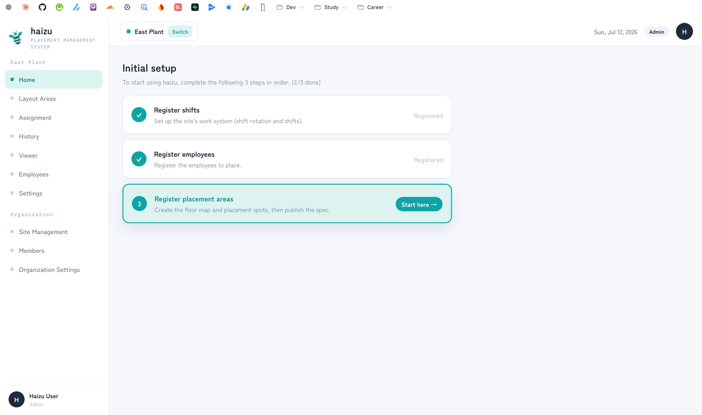
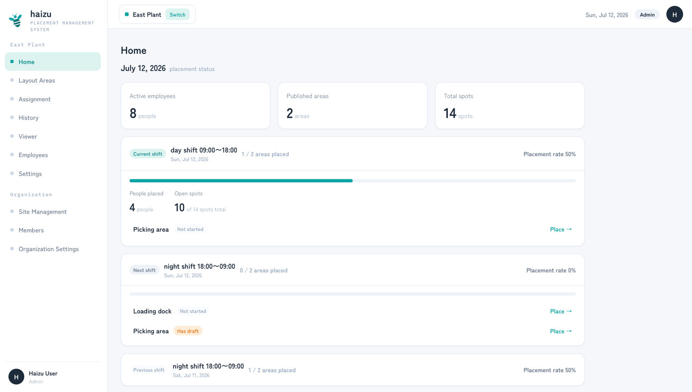

# Home

The screen you land on. It answers two questions: "what's left to set up" and "is today covered".

[日本語](home.ja.md) · [Back to guide index](index.md)

## What you can do

- Follow the **Initial setup** checklist until the site is usable
- See today's placement status per shift, and jump straight to whatever isn't placed yet

## Initial setup

Until all three steps are done, Home shows a checklist with a progress count.

| Step | Meaning | Done when |
|---|---|---|
| **Register shifts** | Set up the site's work system (shift rotation and shifts) | Shifts are saved |
| **Register employees** | Register the employees to place | At least one employee exists |
| **Register placement areas** | Create the floor map and placement spots, then publish the spec | A spec is **published** — a draft shows *Draft (unpublished)* and does not count |

The button on the current step (**Start here →** / **Continue →**) takes you to the right screen. Work top to bottom; each step depends on the one above it.

The checklist disappears once all three are done.

## Placement status

Once setup is complete, Home shows the status of the current shift, with **Previous shift** and **Next shift** alongside it. The "current" shift is derived from the time ranges you set in [shift settings](settings.md#shifts).

You get, per shift:

- **Placement rate** and **People placed**
- **Open spots** out of the total
- Per-area status: placed, **Has draft**, or **Not started**, with a **Place →** button that opens [Assignment](assignment.md) already on the right date, shift, and area

Also shown: **Active employees**, **Published areas**, **Total spots**.

> A draft placement counts as *Has draft*, not as placed. Only confirmed placements reach the [viewer](viewer.md).

## Notes

- Home is scoped to the **selected site**. Switch sites from the sidebar to see another one.
- Home is visible to **Admin**, **Site Admin**, and **General**. "Other" (viewer-only) members can't open it — they only get the [Viewer](viewer.md). See [members.md](members.md#permissions).
