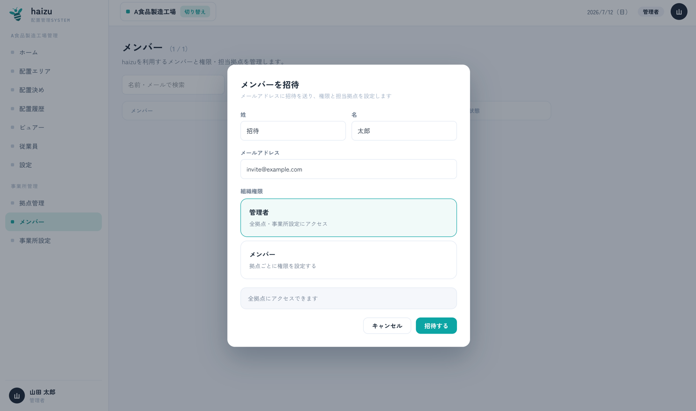
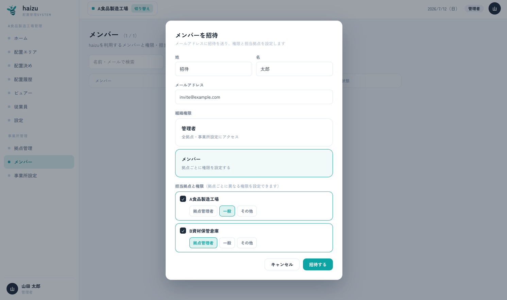
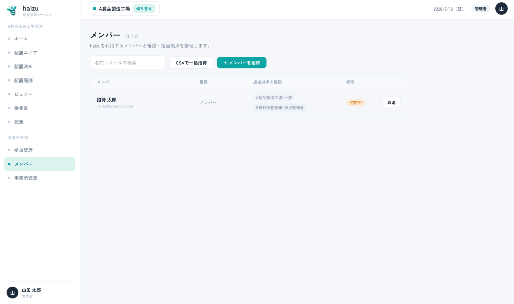
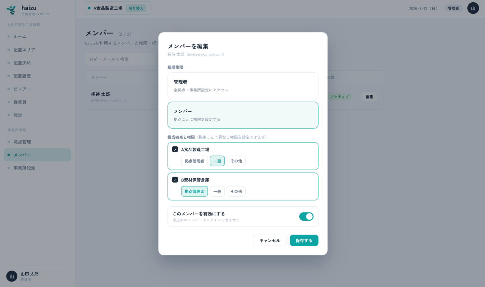
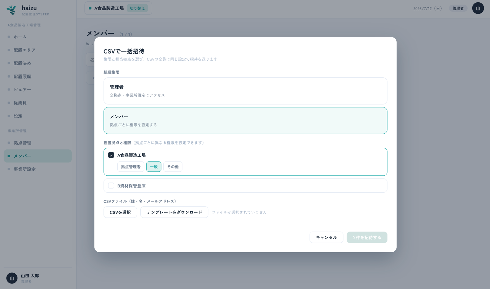
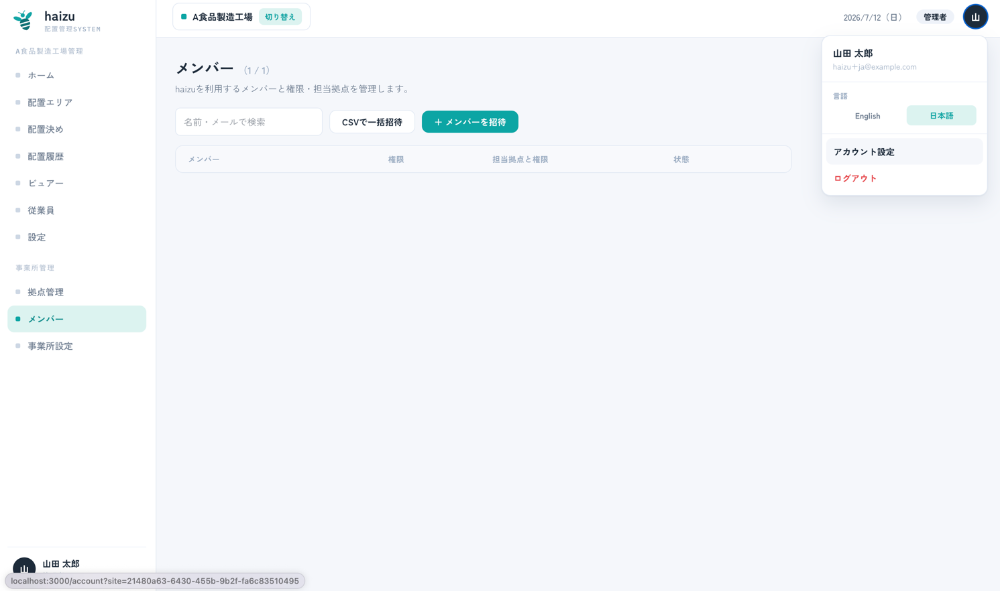
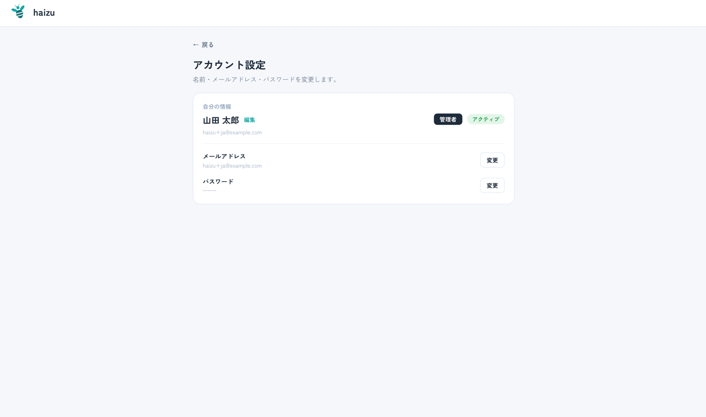

# メンバーと権限

haizu に **ログインする** 人たちです。マップ上に配置されログインしない[従業員](employees.ja.md)とは別の概念です。

[English](members.md) · [マニュアル目次に戻る](index.ja.md)

<!-- screenshot: members-01-list.png -->

## できること

- メールアドレスでメンバーを **招待** する（1人ずつ、またはCSVで一括）
- メンバーごとに **組織権限** と **拠点ごとの権限** を設定する
- メンバーを停止する、招待を取り消す
- 自分の名前・メールアドレス・パスワードを変更する

権限モデルの仕様は [docs/domain/member_permission.md](../domain/member_permission.md) にあります。

## 1人ずつ招待する

1. **＋ メンバーを招待** を押します。
2. 姓・名・メールアドレスを入力します。
3. **組織権限** を選びます。
   - **管理者** — 全拠点・事業所設定にアクセスできます。
   - **メンバー** — 権限を **拠点ごと** に設定します。
4. 「メンバー」の場合は、担当拠点と、拠点ごとの権限を選びます。同じ人でも拠点ごとに異なる権限を設定できます。
5. **招待する** を押します。

- 管理者

- メンバー

招待された人にはリンク付きのメールが届き、パスワードを設定するとログインできます。設定するまでは **招待中** と表示され、**取消** で招待を取り消せます。

既存の組織へ本人が自分で登録する手段はありません（新規登録すると**別の組織**が作られます）。同僚は必ず招待から参加させてください。

## メンバーを編集する（権限の変更・停止）

一覧からメンバーを選ぶと **メンバーを編集** が開き、招待時と同じ項目を後から変更できます。

- **組織権限** を「管理者」と「メンバー」の間で変更する
- 「メンバー」の場合、**担当拠点** の追加・削除と、**拠点ごとの権限**（拠点管理者／一般／その他）の変更
- **このメンバーを有効にする** のチェックを外して **停止** する（停止中のメンバーはログインできません。記録と履歴は残ります）

変更は **保存する** を押した時点で反映されます。すでにログイン中のメンバーには、次の画面遷移から新しい権限が適用されます。

変更できない組み合わせもあります。

- **自分自身の権限は変更できません。** 誰も自分を昇格・降格できません。
- **拠点管理者は管理者を選べません。** 管理者への昇格（および管理者としての招待）ができるのは管理者だけです。
- 拠点管理者が権限を変更できるのは **自分が拠点管理者である拠点** の分だけです。他拠点の権限には触れません。

## CSVで一括招待

**CSVで一括招待** は、CSVに載っている全員を **同じ権限・同じ担当拠点** で招待します。先に権限と担当拠点を選んでからアップロードしてください。

- 列は **姓・名・メールアドレス** です。**テンプレートをダウンロード** すると正しい形式のファイルが得られます。
- 1ファイルあたり **最大200行** です。
- プレビューで各行が **正常** / **エラー** と表示されます。従業員のCSV取込と違い、**エラー行はスキップ**され、正常な行だけが招待されます。
- エラーの種類：姓が空、メールアドレスが空、メールアドレスの形式が不正、CSV内で重複、既存のメンバー・招待と重複。

## 権限

権限は2つのスコープに分かれます。**組織権限** は1人につき1つ、**拠点権限** は拠点ごとに変えられます。

| 権限 | できること |
|---|---|
| **管理者** | すべて。全拠点に加え、事業所設定と拠点管理も可能 |
| **拠点管理者** | 担当拠点内のすべて。ただし管理者としての招待・昇格、事業所設定、拠点の作成・編集は不可 |
| **一般** | 閲覧のみ（ホーム・配置履歴・ビュアー）。加えて自分の情報の編集 |
| **その他** | ビュアーの閲覧のみ |

権限ごとに見える画面：

| 画面 | 管理者 | 拠点管理者 | 一般 | その他 |
|---|:--:|:--:|:--:|:--:|
| ホーム | ✓ | ✓ | ✓ | — |
| 配置エリア | ✓ | ✓ | — | — |
| 配置決め | ✓ | ✓ | — | — |
| 配置履歴 | ✓ | ✓ | ✓ | — |
| ビュアー | ✓ | ✓ | ✓ | ✓ |
| 従業員 | ✓ | ✓ | — | — |
| 設定（シフト・タグ・ビュアー） | ✓ | ✓ | — | — |
| メンバー | ✓ | ✓ | — | — |
| 拠点管理 | ✓ | — | — | — |
| 事業所設定 | ✓ | — | — | — |
| アカウント設定 | ✓ | ✓ | ✓ | ✓ |

拠点権限が効くのは、そのメンバーの担当拠点だけです。拠点管理者がメンバーを管理できるのは **自分が拠点管理者である拠点** に限られ、管理者権限を付与することはできません。また、自分自身の権限は誰も変更できません。

現場モニター用のアカウントには **その他** を割り当ててください。ビュアー以外は開けなくなります。

## 自分のアカウント

- メンバー画面の **自分の情報**、またはサイドバーのユーザーメニューの **アカウント設定** から操作します。
- 名前、**メールアドレス**（新しいアドレスに送られる確認コードで確定）、**パスワード**（現在のパスワードが必要）を変更できます。
- 言語の切り替えもここにあります。選択内容は記憶され、環境の既定値より優先されます。

## 注意点

- 停止中のメンバーはログインできませんが、記録と履歴はそのまま残ります。
- メンバーと担当拠点は事業所（組織）全体で管理されます。従業員は拠点ごとの管理です。
