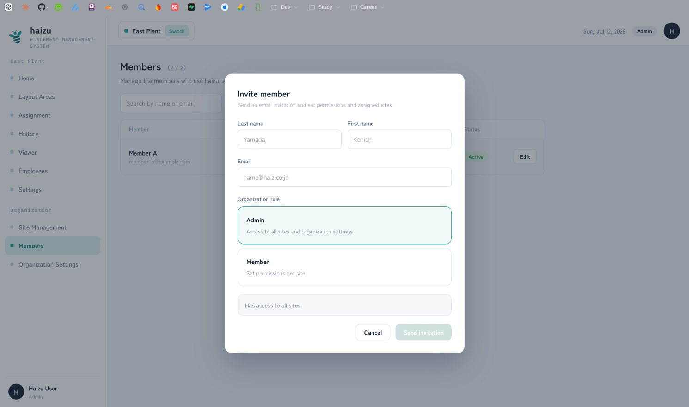
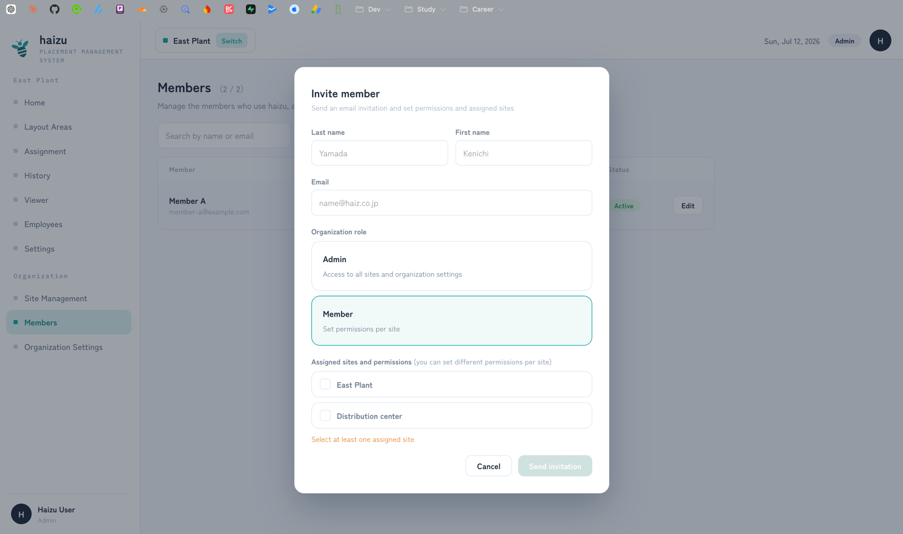
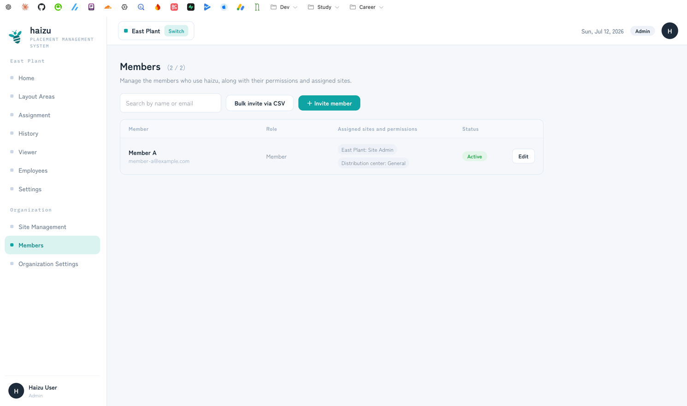
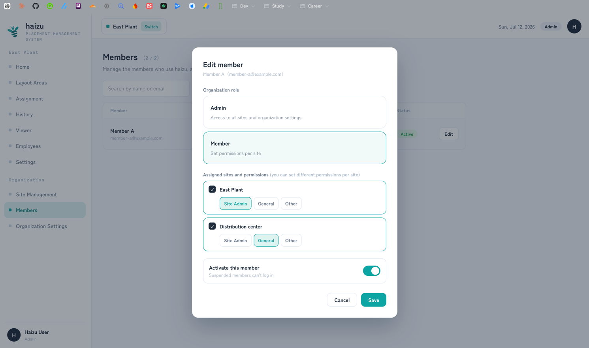
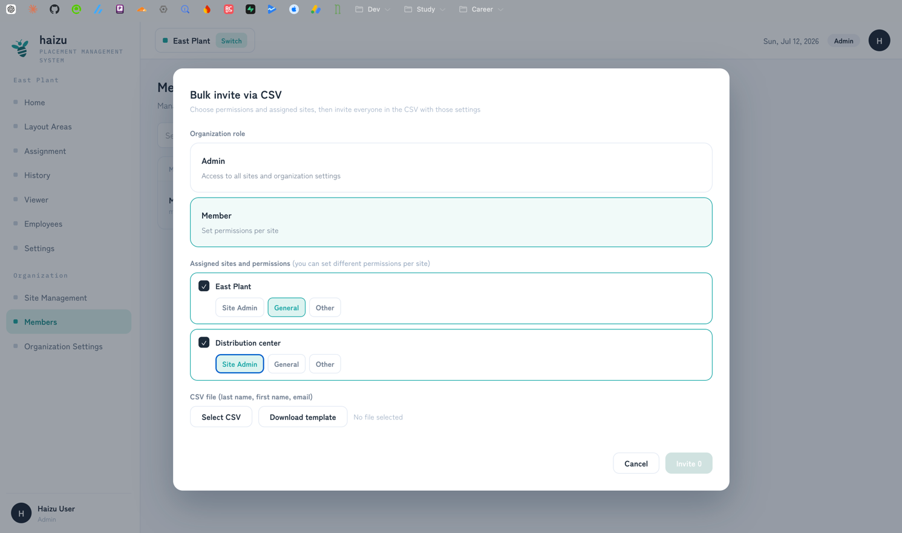
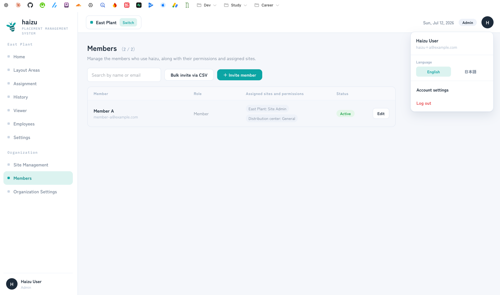
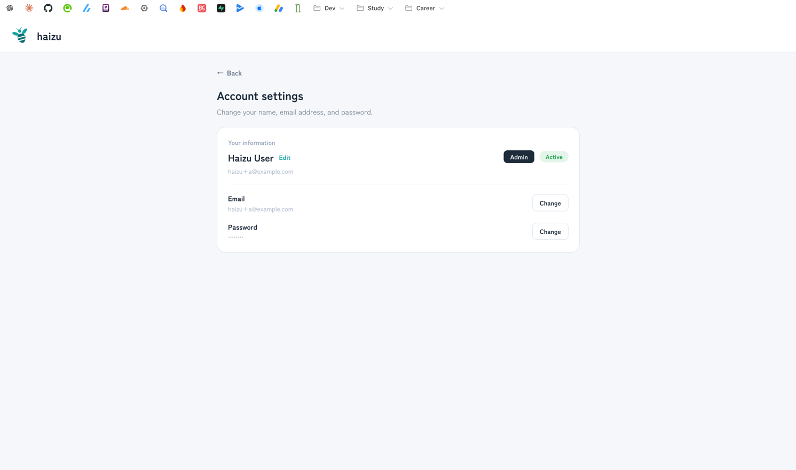

# Members and permissions

The people who **log in** to haizu. Distinct from [employees](employees.md), who are placed on the map and never log in.

[日本語](members.ja.md) · [Back to guide index](index.md)

## What you can do

- **Invite** members by email, one at a time or in bulk from a CSV
- Set each member's **organization role** and their **role per site**
- Suspend a member, or cancel a pending invitation
- Change your own name, email, and password

The model is specified in [docs/domain/member_permission.md](../domain/member_permission.md).

## Inviting one member

1. **＋ Invite member**.
2. Enter last name, first name, and email.
3. Choose the **Organization role**:
   - **Admin** — access to all sites and organization settings.
   - **Member** — permissions are then set **per site**.
4. For a Member, pick the assigned sites and, for each, the site role. Different sites can have different roles for the same person.
5. **Send invitation**.

The invitee gets an email with a link, sets their password, and can then log in. Until they do, they show as **Invited**, and you can **Cancel** the invitation.

There is no self-service sign-up into an existing organization — signing up creates a *new* organization, so always bring colleagues in via an invitation.

## Editing a member (changing permissions, suspending)

Selecting a member from the list opens **Edit member**, where everything you set at invitation time can be changed later.

- Switch the **organization role** between Admin and Member
- For a Member, add or remove **assigned sites**, and change the **site role** at each one (Site Admin / General / Other)
- Uncheck **Activate this member** to **suspend** them (suspended members can't log in; their record and history remain)

Changes take effect when you press **Save**. A member who is already logged in gets the new permission from their next navigation.

Some changes aren't possible:

- **You can't change your own permission.** Nobody can promote or demote themselves.
- **A Site Admin can't choose Admin.** Only an Admin can promote someone to admin (or invite one).
- A Site Admin can only change permissions at **sites where they are a site admin** — never at another site.

## Bulk invite via CSV

**Bulk invite via CSV** invites everyone in a CSV **with the same permissions and the same assigned sites**. Choose those settings first, then upload.

- Columns: **Last name, First name, Email**. **Download template** gives you the exact file.
- Up to **200 rows** per file.
- The preview marks each row **Valid** or **Error**. Unlike the employee import, **rows with errors are simply skipped** — the valid rows are still invited.
- Errors: last name empty, email empty, invalid email format, duplicate email within the CSV, or duplicates an existing member or invitation.

## Permissions

Roles come in two scopes: one **organization role**, and a **site role that can differ per site**.

| Role | Can do |
|---|---|
| **Admin** | Everything, at every site, plus organization settings and site management |
| **Site Admin** | Everything within their sites — except inviting/promoting an admin, organization settings, and creating or editing sites |
| **General** | View only: home, assignment history, and the viewer. Plus editing their own info |
| **Other** | The viewer only |

Which screens each role sees:

| Screen | Admin | Site Admin | General | Other |
|---|:--:|:--:|:--:|:--:|
| Home | ✓ | ✓ | ✓ | — |
| Layout areas | ✓ | ✓ | — | — |
| Assignment | ✓ | ✓ | — | — |
| History | ✓ | ✓ | ✓ | — |
| Viewer | ✓ | ✓ | ✓ | ✓ |
| Employees | ✓ | ✓ | — | — |
| Settings (shifts, tags, viewer) | ✓ | ✓ | — | — |
| Members | ✓ | ✓ | — | — |
| Site management | ✓ | — | — | — |
| Organization settings | ✓ | — | — | — |
| Account settings | ✓ | ✓ | ✓ | ✓ |

A site role only applies at the sites the member is assigned to. A Site Admin manages members **only at sites where they are a site admin**, and cannot grant admin. Nobody can change their own permission.

Give a floor monitor account the **Other** role: it can open nothing but the viewer.

## Your own account

- **Your information** on the members screen, or **Account settings** from the sidebar user menu.
- Change your name, your **email address** (confirmed with a verification code sent to the new address), and your **password** (requires your current one).
- The language switcher is here too — your choice is remembered and overrides the deployment default.

## Notes

- Suspended members can't log in, but their record and history remain.
- Members and their site assignments are organization-wide; employees are per-site.
