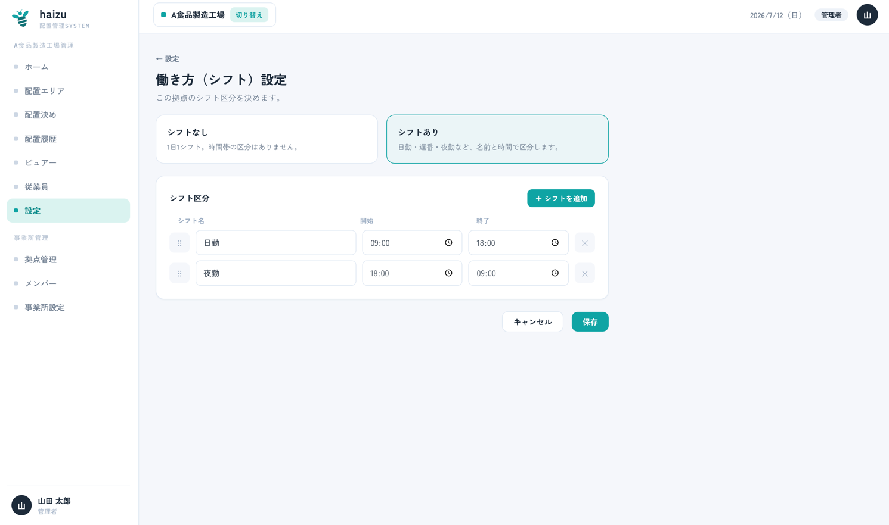
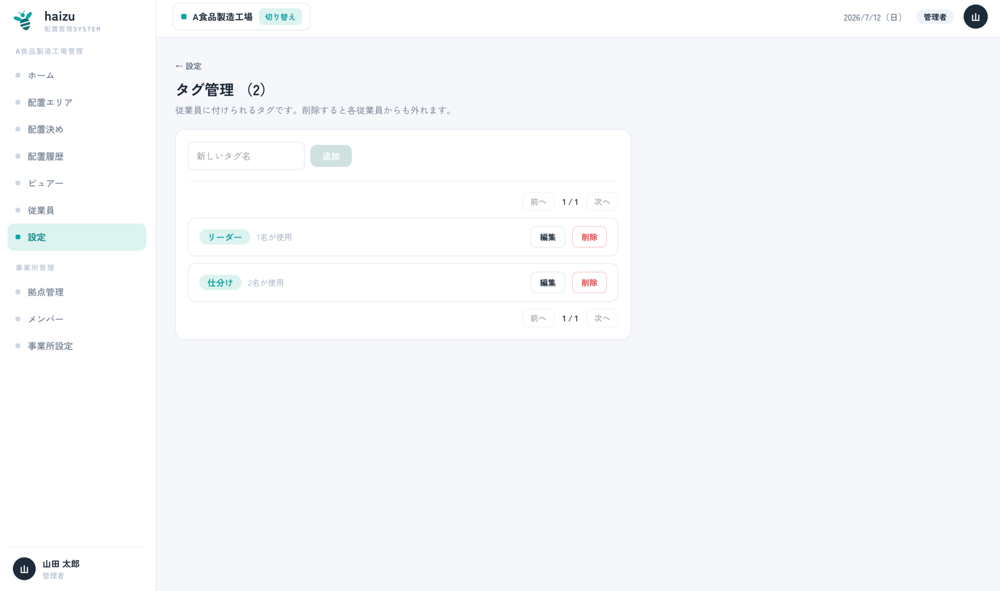
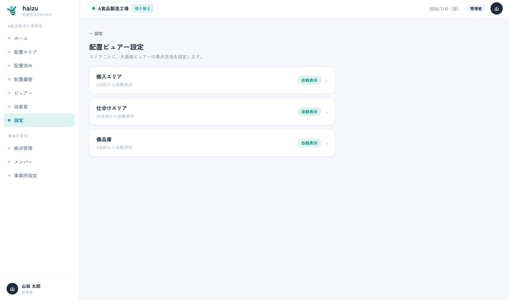
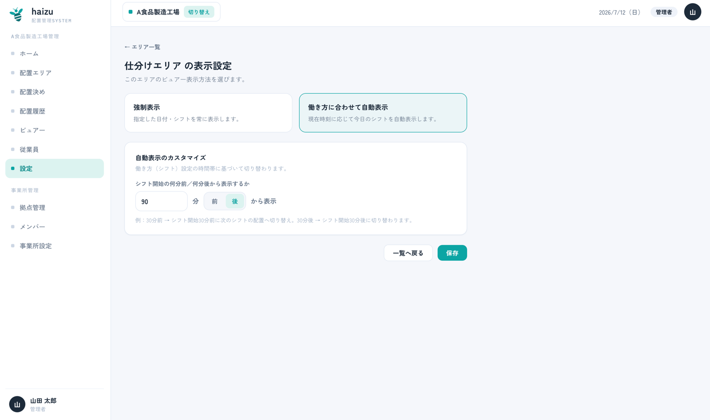
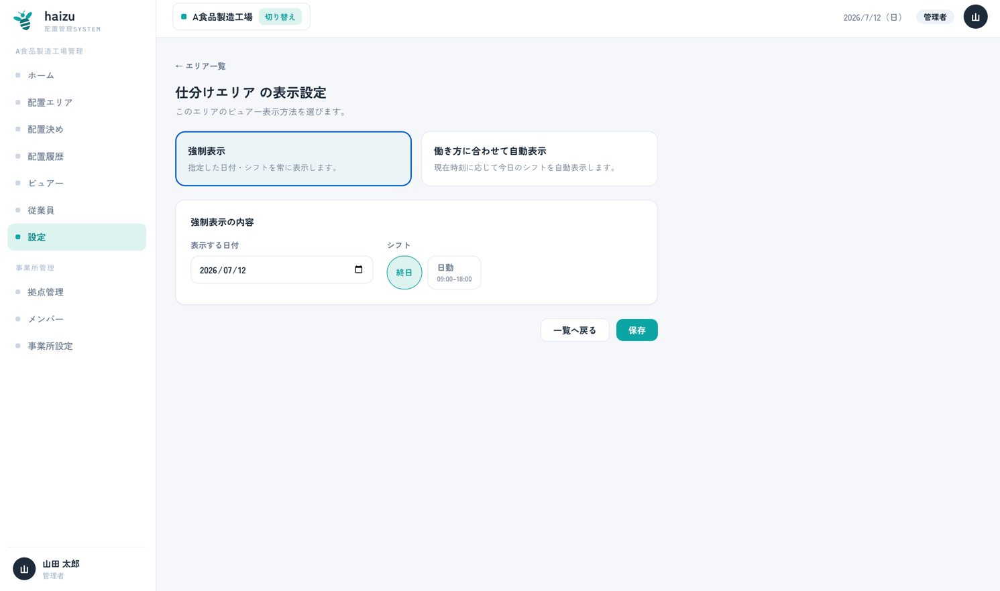
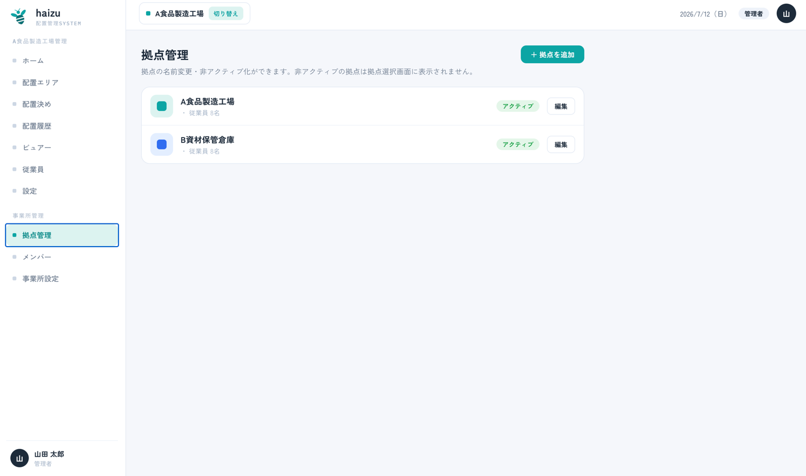
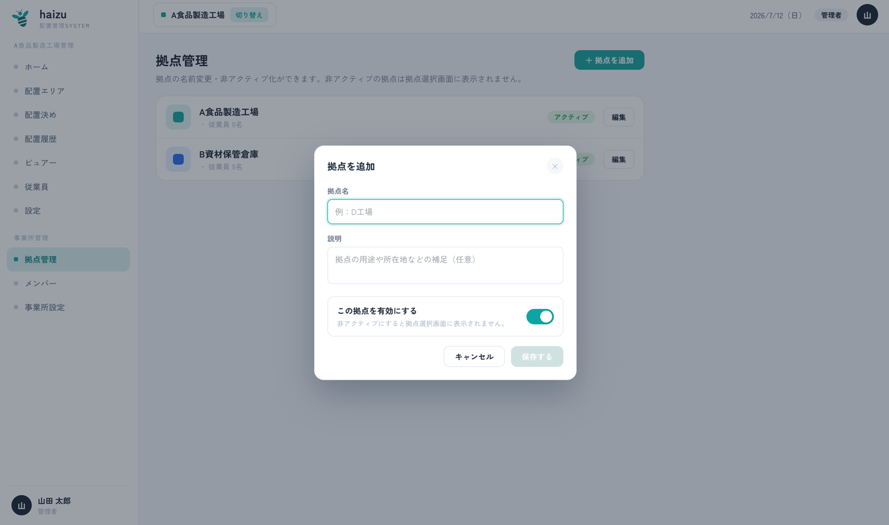
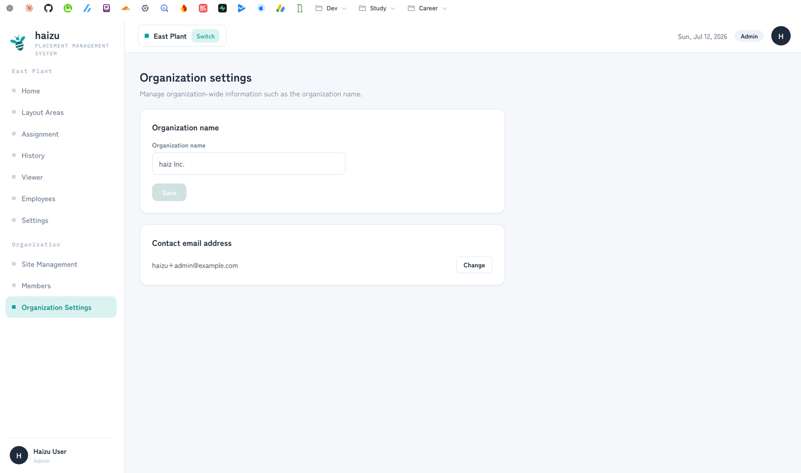
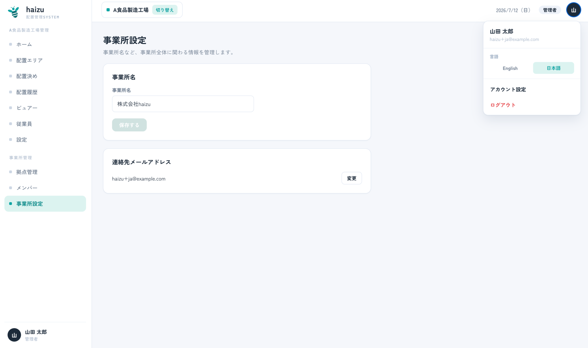

# 設定

一度決めたら、あとはあまり触らない項目をまとめています。

[English](settings.md) · [マニュアル目次に戻る](index.ja.md)

**設定** 画面には、拠点単位の3つの設定（シフト・タグ・ビュアー表示）があります。拠点管理と事業所設定はサイドバーの別項目（管理者のみ）、自分のアカウント設定はユーザーメニューにあります。

## 働き方（シフト）設定

*設定 → 働き方（シフト）設定*。この拠点で1日をどう区切るかを決めます。

- **シフトなし** — 1日1シフト。時間帯の区分なし。配置決めもビュアーも区分なしで扱います。
- **シフトあり** — 日勤・遅番・夜勤など、名前と時間で区分します。**＋ シフトを追加** で **シフト名**・**開始**・**終了** を設定します。ドラッグで並び替えできます。

開始・終了が同じシフトは作れません。シフト名も重複できません。

> **後からシフトを変更すると、作成中の作業が破棄されます。** 変更・削除したシフトの配置決めの **下書き** は、保存時に破棄されます（保存前に確認ダイアログが出ます）。確定済みの配置は影響を受けず、[配置履歴](history.ja.md)にも残ります。

最初に設定すべき項目です。[ホーム](home.ja.md)の状況表示、[配置決め](assignment.ja.md)、ビュアーの自動切り替えは、いずれもここの時間帯を参照します。

## タグ管理

*設定 → タグ管理*。従業員に付ける自由なラベルです（「フォークリフト」「新人」「検査資格あり」など）。配置決めのときに候補を絞り込むために使います。

- 名前を入力して追加します。一覧から編集・削除でき、各タグを何名が使用しているかも表示されます。
- **タグを削除すると、そのタグを持つ全従業員からも外れます。** 確認ダイアログに対象人数が表示されます。
- CSV取込でタグを指定するには、**事前に**タグが登録されている必要があります。→ [employees.ja.md](employees.ja.md#csv取込)
- 1人の従業員に付けられるタグは最大10個です。

## 配置ビュアー設定

*設定 → 配置ビュアー設定*。エリアごとに、大画面に何を映すかを決めます。挙動の説明は [viewer.ja.md](viewer.ja.md#何をいつ表示するか) にあります。ここはその設定場所です。

- **働き方に合わせて自動表示** — 時刻に追従します。シフト開始の **何分前／何分後** にそのシフトの配置へ切り替えるかを設定します（例：30分前にすると、早く来た人が次のシフトの配置を見られます）。

- **強制表示** — 特定の **日付** とシフトを固定表示します。ビュアーには *強制表示中* のバッジが出ます。

一覧では各エリアに **自動表示** / **強制表示** のバッジが付き、一目で判別できます。

## 拠点管理

*サイドバー → 拠点管理*。**管理者のみ。**

**拠点** は工場・倉庫1つを指します。従業員・エリア・配置はすべていずれかの拠点に属します。

- **＋ 拠点を追加** で拠点名と説明（任意）を入力します。

- 非アクティブにすると拠点選択画面に表示されなくなります。データは保持されます。
- 操作対象の拠点はサイドバーの **切り替え** から変更します。

## 事業所設定

*サイドバー → 事業所設定*。**管理者のみ。**

事業所（組織）は会社そのもので、全拠点の最上位にあたります。**事業所名** と **連絡先メールアドレス**（確認コードで確定）を設定します。

## アカウント設定

自分の名前・メールアドレス・パスワード・**言語** を設定します。サイドバーのユーザーメニューから開けます。すべての権限で利用できます。→ [members.ja.md](members.ja.md#自分のアカウント)

