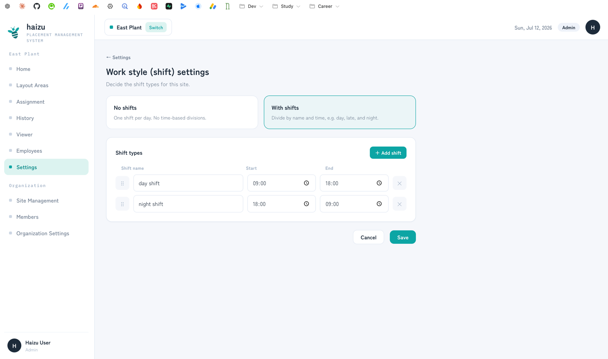
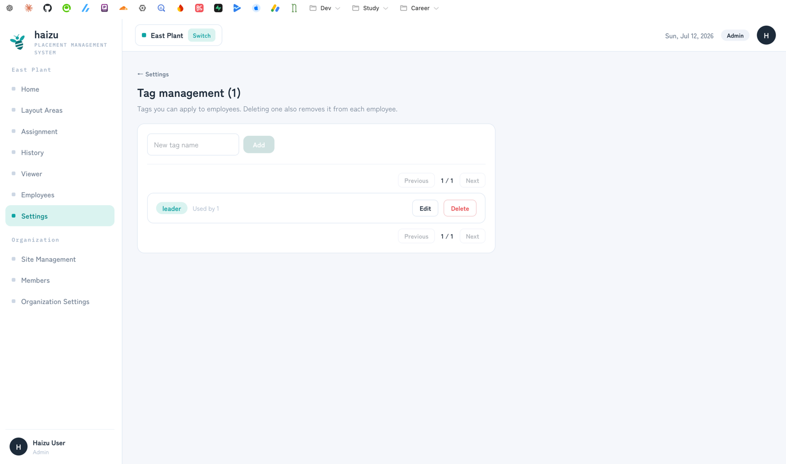
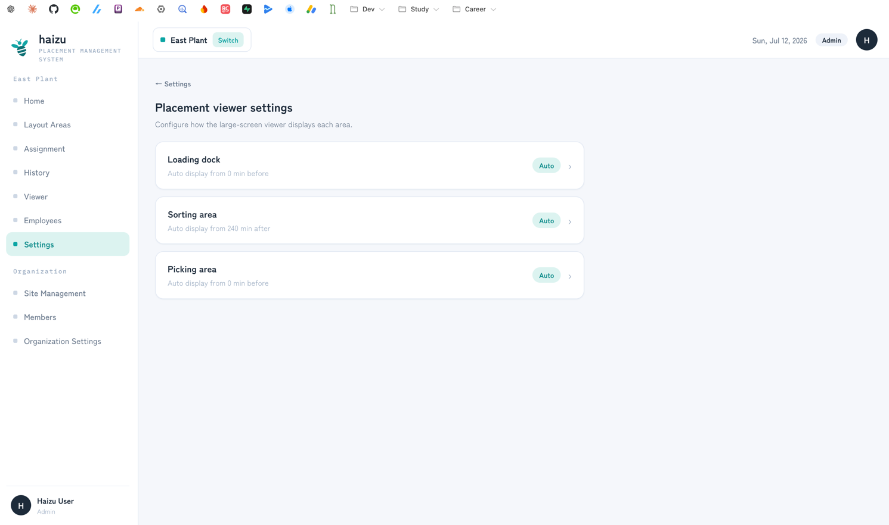
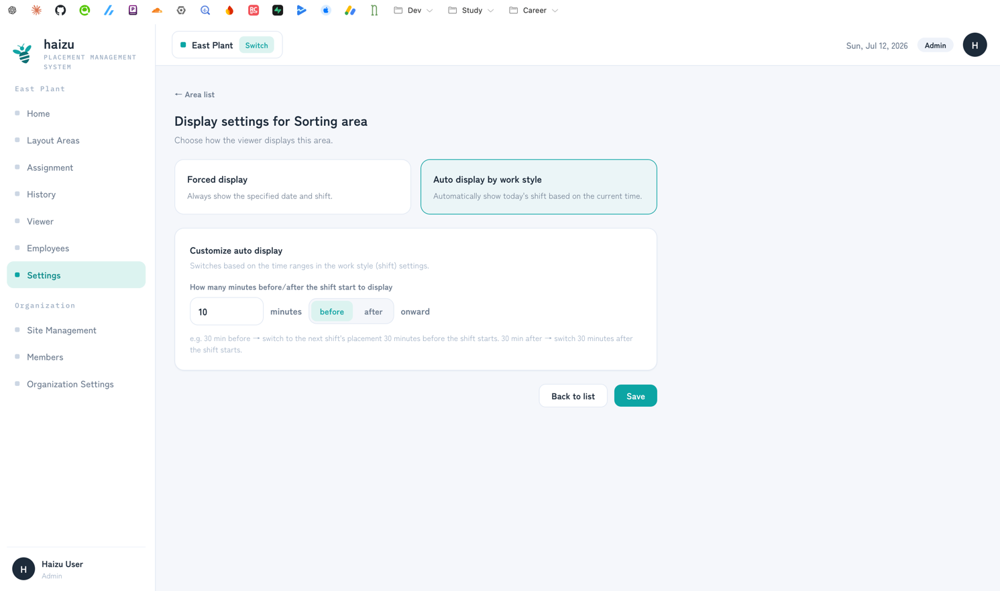
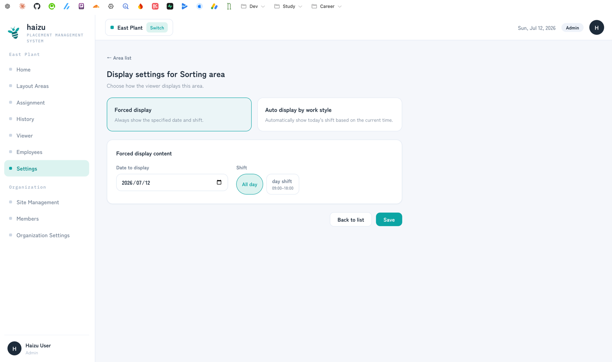
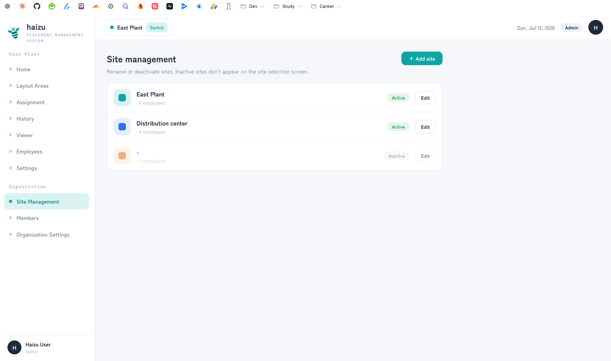
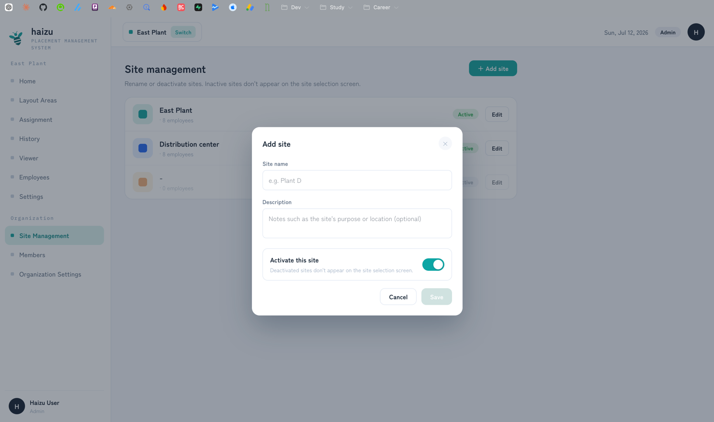
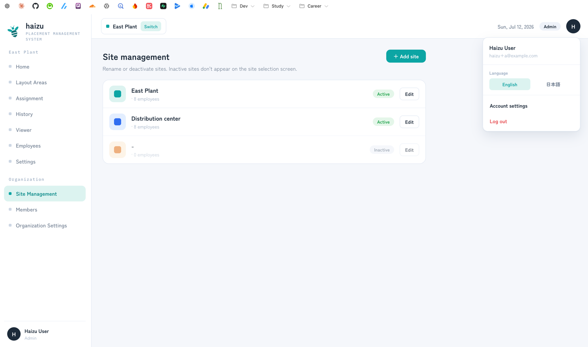

# Settings

Everything you configure once and then mostly leave alone.

[日本語](settings.ja.md) · [Back to guide index](index.md)

The **Settings** hub holds three site-level settings: shifts, tags, and viewer display. Site management and organization settings live separately in the sidebar (Admins only), and your own account is at the bottom of the user menu.

## Shifts

*Settings → Work style (shift) settings.* Choose how the day is divided at this site.

- **No shifts** — one shift per day, no time divisions. Assignment and the viewer then work without shift divisions.
- **With shifts** — divide by name and time (day / late / night, …). Add each with **＋ Add shift**, setting **Shift name**, **Start**, and **End**. Drag to reorder.

Two shifts can't share the same start and end times, and names must be unique.

> **Changing shifts later discards work in progress.** Assignment **drafts** for changed or deleted shifts are discarded when you save — the app warns you before saving. Confirmed placements are untouched and remain in [history](history.md).

This is the first thing to set up: the [home](home.md) status, [assignment](assignment.md), and the viewer's automatic switching all read these time ranges.

## Tags

*Settings → Tag management.* Free-form labels you apply to employees ("forklift", "new hire", "inspection-certified", …), used to filter the pool when assigning.

- Type a name and add it. Edit or delete from the list; each tag shows how many employees use it.
- **Deleting a tag also removes it from every employee** who has it. The confirmation tells you how many.
- Tags must exist **before** a CSV import can reference them — see [employees.md](employees.md#csv-import).
- An employee can carry up to 10 tags.

## Viewer settings

*Settings → Placement viewer settings.* Per area, decide what the big screen shows. See [viewer.md](viewer.md#what-it-shows-and-when-it-switches) for the behavior; here's where you set it.

- **Auto display by work style** — follows the clock. Set how many **minutes before or after** the shift start it switches to that shift's placement (e.g. 30 minutes before, so early arrivals see the coming shift).

- **Forced display** — pin a specific **date** and shift. The viewer then carries a *Forced* badge.

Each area shows an **Auto** or **Forced** badge in the list so you can tell at a glance.

## Site management

*Sidebar → Site Management.* **Admins only.**

A **site** is one factory or warehouse. Employees, areas, and assignments all belong to one.

- **＋ Add site** with a name and an optional description.

- Deactivate a site to hide it from the site selection screen. Existing data is kept.
- Switch the site you're working in from the sidebar (**Switch**).

## Organization settings

*Sidebar → Organization Settings.* **Admins only.**

The organization is the company — the top-level container for every site. Set the **organization name** and a **contact email address** (confirmed with a verification code).

## Account settings

Your own name, email, password, and **language**. Reachable from the sidebar user menu. Available to every role. See [members.md](members.md#your-own-account).

