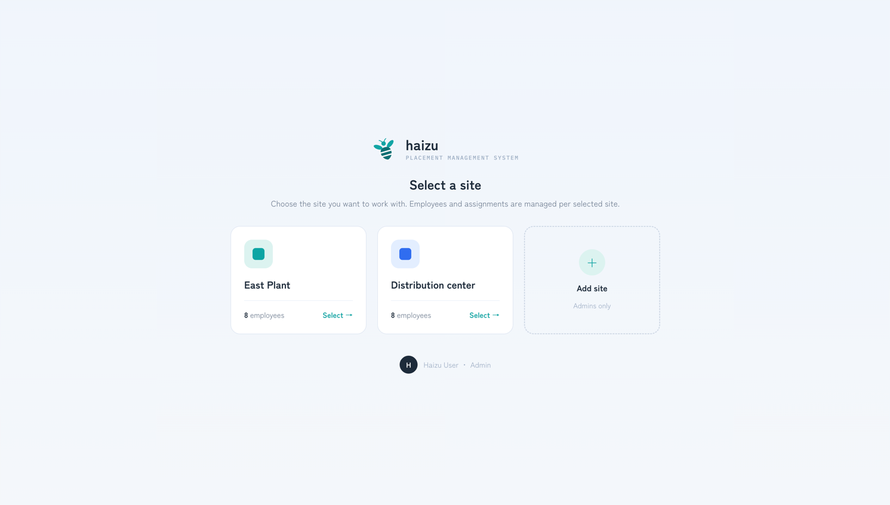
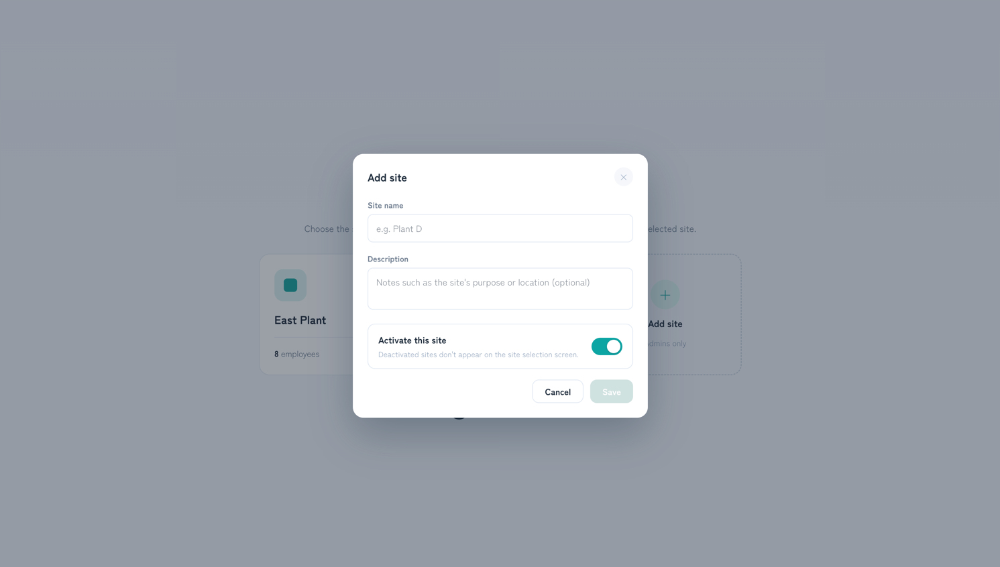

# Site selection

The screen right after login. You pick which factory or warehouse you're working in.

[日本語](site-selection.ja.md) · [Back to guide index](index.md)

## Why it exists

A **site** is one factory or warehouse, and it scopes almost everything: employees, layout areas, assignments, shifts, tags, and history all belong to a site. Nothing in the app makes sense until one is chosen, so this screen comes first.

Permissions are per site too — the same person can be a Site Admin at one site and view-only at another. See [members.md](members.md#permissions).

## Steps

1. Log in. If you have access to more than one site, you land here.
2. Each card shows the site's name, description, and employee count. Press **Select →**.
3. You land on the screen your permission at *that site* allows: normally [Home](home.md), or straight to the [Viewer](viewer.md) if your role there is viewer-only.

To move to another site later, use **Switch** in the sidebar — you don't have to log out.

## Adding a site

**Add site** on this screen creates one, but it's **Admins only** — the button is disabled for everyone else, marked *Admins only*.

Sites can also be managed from [Settings → Site management](settings.md#site-management), where you can rename them or deactivate one.

## Notes

- **Only active sites appear here.** Deactivating a site in site management hides it from this screen without deleting its data.
- You only see sites you're assigned to. Admins see all of them.
- The current site is part of the URL (`/s/<siteId>/…`), so a bookmarked link reopens the same site directly.
