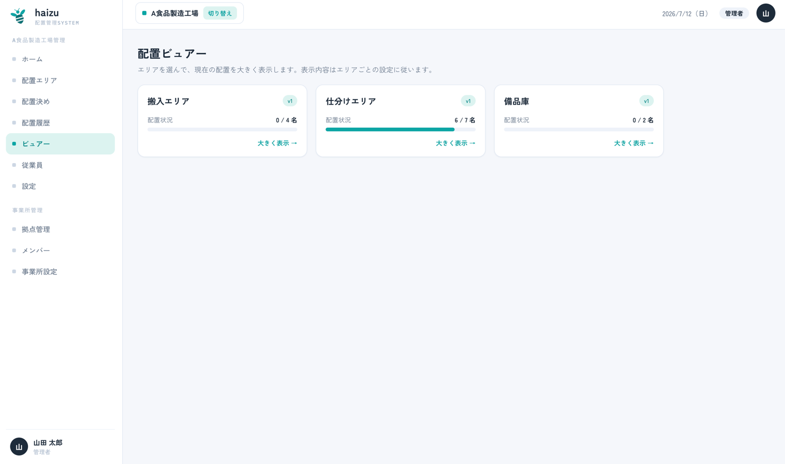
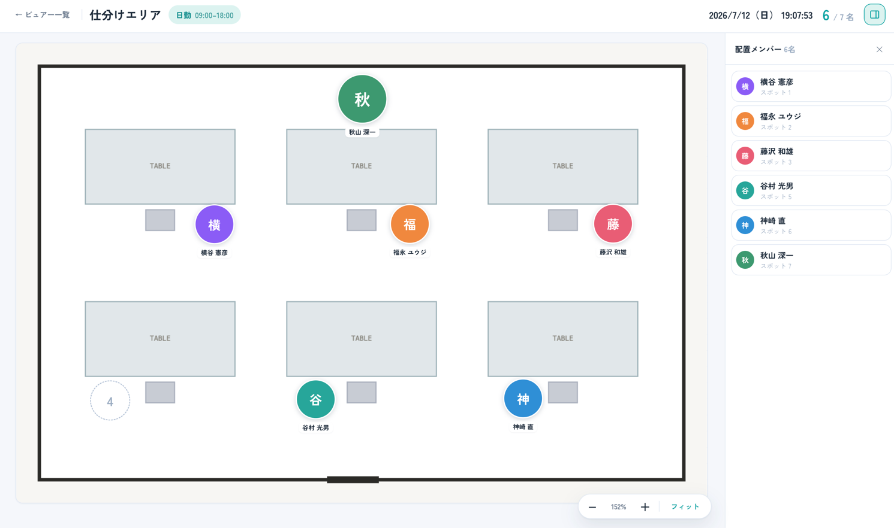
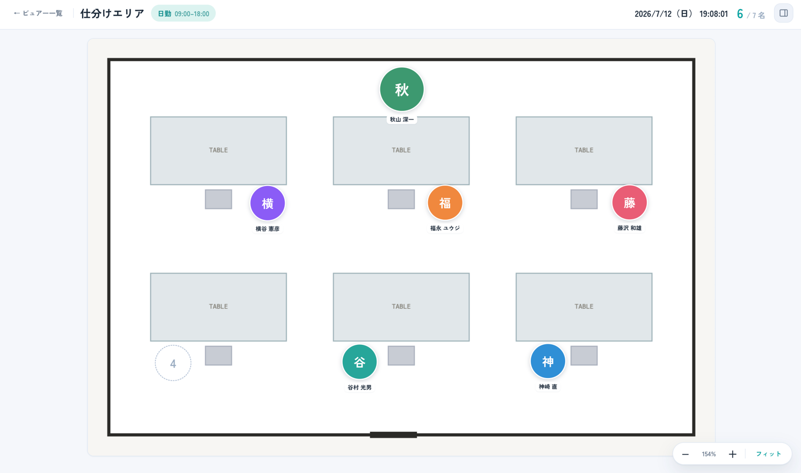

# 配置ビュアー

現場が見る画面です。表示専用で、ここから配置が変わることはありません。

[English](viewer.md) · [マニュアル目次に戻る](index.ja.md)

## できること

- エリアの **確定済み** 配置をモニターに大きく表示する
- **配置メンバー** の一覧パネルを開閉する
- 時刻に追従して自動表示させる、または特定の日付・シフトを強制表示する

仕様： [docs/domain/layout_viewer.md](../domain/layout_viewer.md)

## 操作手順

1. サイドバーの **ビュアー** に、エリアごとの現在の配置状況が一覧表示されます。

2. **大きく表示 →** で全画面表示になります。現場のモニターにこの画面を映してください。
3. **フィット** で図面をウィンドウに合わせ直せます。**メンバーパネルの表示切替** で **配置メンバー** の一覧を開閉できます。

ヘッダーには表示日と、いま表示しているシフトが出ます。

## 何を、いつ表示するか

エリアごとに [設定 → 配置ビュアー設定](settings.ja.md#配置ビュアー設定) で決めます。

- **働き方に合わせて自動表示**（初期値）— [シフト設定](settings.ja.md#働き方シフト設定)の時間帯に基づき、現在時刻に応じて今日のシフトを表示します。シフト開始の何分**前／後**に切り替えるかを調整できます。例：「30分前」なら、シフト開始の30分前に次のシフトの配置へ切り替わります（早めに来る人向け）。
- **強制表示** — 指定した日付・シフトを常に表示します。ライブ表示と混同しないよう、**強制表示中** のバッジが出ます。特定の日を出しっぱなしにしたいときに使います。

## 注意点

- **表示されるのは確定済みの配置だけです。** 下書きの配置は「誰も配置されていない」状態として表示されます。モニターが空に見えるときは、まず配置が確定されているかを[配置決め](assignment.ja.md)で確認してください。
- エリアに図面がない場合、その旨と[配置エディタ](editor.ja.md)で登録するよう案内が表示されます。
- ビュアーは、「その他」（ビュアー閲覧のみ）を含む**すべての権限**が開ける唯一の画面です。だからこそ共有モニターに出しっぱなしにできます。
