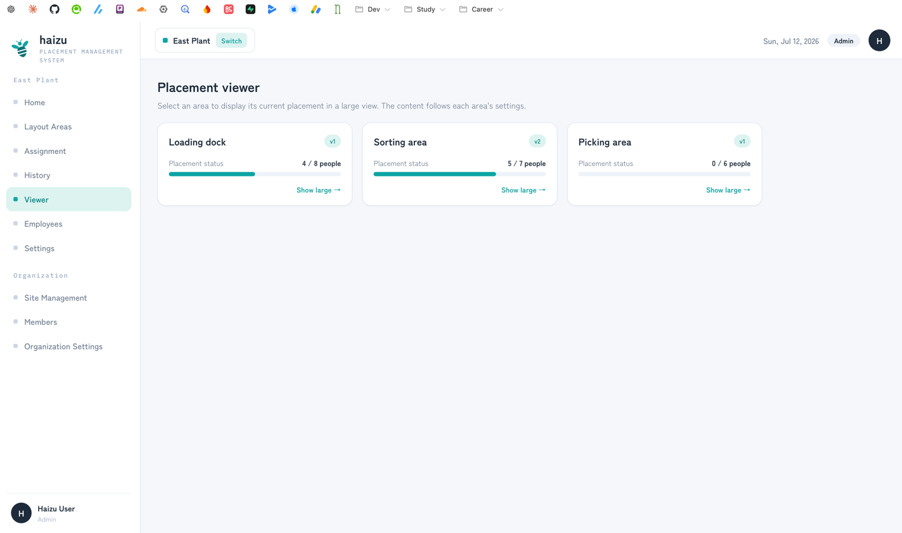
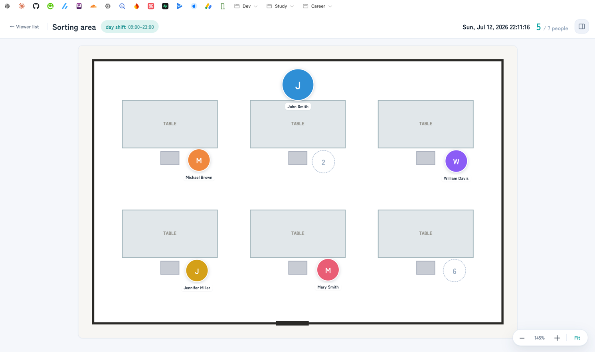

# Viewer

The screen the floor reads. Display-only: nothing here changes a placement.

[日本語](viewer.ja.md) · [Back to guide index](index.md)

## What you can do

- Show an area's **confirmed** placement full-size on a monitor
- Toggle a side panel listing the **placed members**
- Let it follow the clock automatically, or force a specific date and shift

The spec: [docs/domain/layout_viewer.md](../domain/layout_viewer.md).

## Steps

1. **Viewer** in the sidebar lists the areas with their current placement status.
2. **Show large →** opens the full-size view. Point the floor's monitor at it.
3. **Fit** re-fits the plan to the window. **Toggle member panel** shows or hides the list of **Placed members**.

The header shows the display date and the shift it's currently showing.

## What it shows, and when it switches

Per area, in [Settings → Placement viewer settings](settings.md#viewer-settings):

- **Auto display by work style** (default) — follows the current time and shows today's shift, based on the time ranges in your [shift settings](settings.md#shifts). You can tune how many minutes **before or after** the shift start it switches to that shift's placement. E.g. "30 minutes before" means the next shift's placement appears 30 minutes ahead of the shift starting — useful for people arriving early.
- **Forced display** — always show a specified date and shift. The viewer shows a **Forced display** badge so nobody mistakes it for live. Use this for a day you want to keep on screen.

## Notes

- **Only confirmed placements appear.** A draft placement shows as nothing placed. If the monitor looks empty, the placement probably wasn't confirmed — check [Assignment](assignment.md).
- If the area has no floor plan, the viewer says so and asks you to register one in the [layout editor](editor.md).
- The viewer is the one screen **every** role can open, including members with "Other" (viewer-only) permission. That's what makes it safe to leave on a shared monitor.
